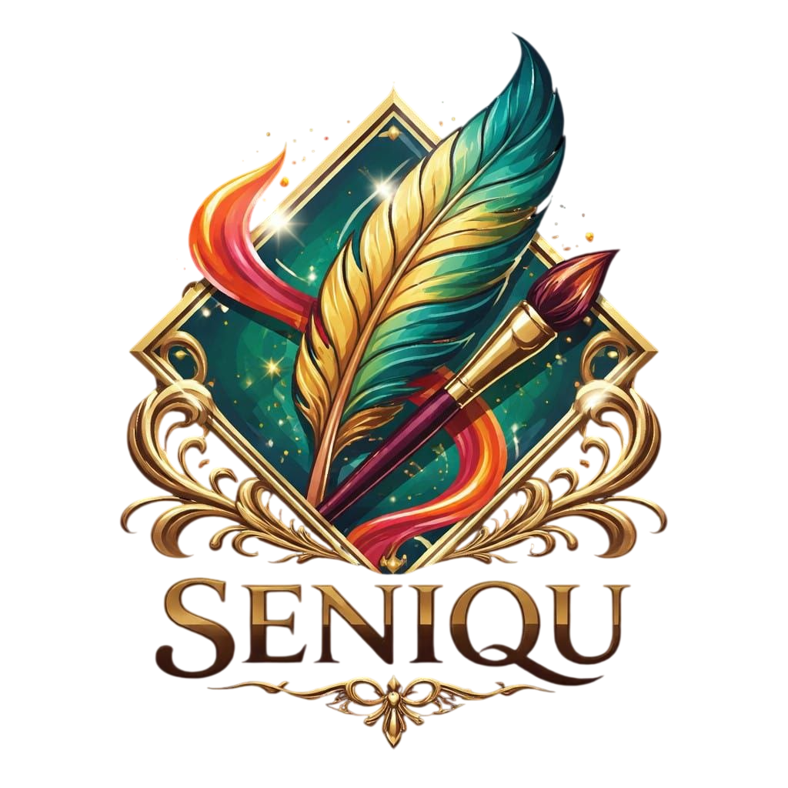

<div align="center">
  

  # SeniQu 
  ### Indonesia's Digital Cultural Heritage Infrastructure

  <p align="center">
    <em>A digital sanctuary for Indonesia's heritage — spanning museums, galleries, and historical sites — where assets are verified, digitized, and preserved for long-term conservation to enable accessible cultural exploration and tourism guidance.</em>
  </p>

  <p align="center">
    <a href="#-the-problem"><strong>The Problem</strong></a> ·
    <a href="#-our-solution"><strong>Our Solution</strong></a> ·
    <a href="#-tech-stack"><strong>Tech Stack</strong></a> ·
    <a href="#-quick-start"><strong>Quick Start</strong></a> ·
    <a href="#-documentation"><strong>Documentation</strong></a>
  </p>

  <p align="center">
    
    
    
  </p>
</div>

---

## 🇮🇩 Indonesia: A Cultural Superpower

Indonesia is the world's most diverse living civilization — **17,000+ islands**, **1,300 ethnic groups**, **4,859 cultural properties**, **450+ museums**, and **1,941 intangible heritage items** officially designated between 2013–2023.

Yet despite this extraordinary richness, **only 54–68% of national cultural assets are formally validated and digitally structured**. Indonesia's heritage is not just a national identity; it is a global cultural asset with untapped digital potential.

---

## 🔴 The Challenge vs ✅ The Solution

<div align="center">

| 🔴 The Challenge | ✅ SeniQu's Solution |
| :--- | :--- |
| **Fragmented Cultural Data**<br>No centralized system connecting museums and heritage sites. | **Centralized Cultural Platform**<br>Unifying heritage buildings into one structured, searchable digital ecosystem. |
| **Isolated Visitor Experience**<br>No smart navigation or contextual storytelling. | **Interactive & Immersive Experience**<br>Mobile-first interfaces with smart digital tools and personalized guides. |
| **Manual Localization**<br>Hard to translate to tourists manually. | **AI-Enhanced Cultural System**<br>Auto-generated summaries, multilingual translation, and content animation. |
| **Underutilized Tourism**<br>Assets not integrated into the digital tourism ecosystem. | **Tourism Optimization**<br>Curated cultural routes and smart event discovery. |

</div>

---

## 💻 Tech Stack

SeniQu is built on a modern, enterprise-grade, monorepo architecture leveraging the latest in Web3 and Web2 infrastructure.

### Frontend 
<p>
  
  
  
  
  
</p>

### Backend & Database
<p>
  
  
  
  
  
</p>

### Infrastructure & Blockchain
<p>
  
  
  
</p>

---

## 🔒 Security Architecture

SeniQu handles high-value cultural assets with enterprise-grade security:

- 🛡️ **Backend Source of Truth** — All wallet actions verified server-side with anti-spoofing
- 🛡️ **Privy Embedded Wallets** — Non-custodial secure enclaves connecting Web2 to Web3 natively
- 🛡️ **Row Level Security (RLS)** — Database-level access policies inside Supabase PostgREST
- 🛡️ **Multi-Tier Rate Limiting** — Global throttler guarding against brute-force and DDoS
- 🛡️ **XSS & SQLi Prevention** — Sanitization pipes, parameterized queries, and strict DTO validation

---

## 🚀 Quick Start

### 1. Prerequisites

- **Node.js** `v18+` (Node `v24` recommended)
- **Supabase** initialized with service keys
- **Privy / WalletConnect** API keys

### 2. Installation

```bash
# Clone the repository
git clone https://github.com/siabang35/seniquwebapp.git
cd seniquwebapp

# Install root dependencies
npm install

# Setup environment variables
cp backend/.env.example backend/.env
cp frontend/.env.example frontend/.env
```

### 3. Start Development Servers

```bash
# Terminal 1 — Start the API Backend
cd backend
npm run start:dev
# REST API running on http://localhost:3001
# Docs running on http://localhost:3001/api/docs

# Terminal 2 — Start the React Frontend
cd frontend
npm run dev
# App running on http://localhost:5173
```

---

## 📚 Documentation

Deep-dive into SeniQu's internal architecture via the [`/doc`](./doc) directory:

- 🏗️ **[Architecture Overview](./doc/01-Architecture.md)**: System design and structural patterns.
- 🎨 **[Frontend Guide](./doc/02-Frontend-Guide.md)**: React components, routing, theming.
- ⚙️ **[Backend Guide](./doc/03-Backend-Guide.md)**: NestJS services, middleware, configuration.
- 🔐 **[Auth & Security](./doc/04-Authentication-Security.md)**: Multi-provider flows (JWT, Privy).
- 🗺️ **[Feature Specs](./doc/05-Feature-Documentation.md)**: AI tools, mapping, tourism features.
- 📦 **[Database Schema](./doc/07-Database-Schema.md)**: ER diagrams, migrations, RLS policies.
- ⛓️ **[Wallet Integration](./doc/09-Wallet-Integration.md)**: Proof of Art (PoA) and hybrid wallets.
- ☁️ **[Cloudflare R2 Storage](./doc/10-Cloudflare-R2-Integration.md)**: CDN, image optimizations, and zero-egress file hosting.
- 🤖 **[Cloudflare Workers AI](./doc/15-Cloudflare-Workers-AI.md)**: Flux generative artwork pipeline and fallback architecture.
- 📸 **[Gemini 3.6 & 3.5 Flash Heritage Analyzer](./doc/16-Gemini-Heritage-Analyzer.md)**: Multimodal dual model chain (`gemini-3.6-flash` ➔ `gemini-3.5-flash`), 503/429 auto-retry backoff, expanded token output budget (4096 tokens), `safeParseJson` auto-repair, Fastify parallel execution (`Promise.all`), daily quota tracking, Web Speech audio narration, and R2 backup storage.
- 🧪 **[Gemini AI Curation Lab](./doc/17-Gemini-AI-Curation-Lab.md)**: Interactive Before/After digital restoration lab, authentic color palette, Dublin Core metadata, and TTS audio guides.
- 🎥 **[Shorts, Reels, & Social Follow System](./doc/20-Shorts-Reels-And-Social-Follow-System.md)**: Custom player short-form Reels feed, interactive multi-step video editor (trimming, playback speed, aspect ratio crop, visual filters), Spotify soundtrack & local audio uploads, forum video uploads, user follow network, and sidebar UX hierarchy.
- 🔔 **[AI Moderation & Notifications](./doc/21-Content-Moderation-And-Notifications.md)**: AI image/video screening with Google Cloud Vision & Video Intelligence, real-time in-app notifications, and anti-spam throttled email delivery.
- ⚡ **[Real-Time Scan & Fastify Speed Optimizations](./doc/24-Gemini-3-6-Flash-Realtime-Scan-And-Fastify-Optimizations.md)**: Live AR camera scanning powered by Gemini 3.6 Flash, Fastify concurrent uploads/analysis, clean title parsing, and high-contrast responsive Light/Dark theme typography.


---

## 🤝 Contributing

We welcome institutional and open-core contributions to help digitize Nusantara's Soul.

1. Fork the Project
2. Create a Feature Branch (`git checkout -b feature/InteractiveGallery`)
3. Commit your Changes (`git commit -m 'feat: Add 3D Gallery Support'`)
4. Push to the Branch (`git push origin feature/InteractiveGallery`)
5. Open a Pull Request

## 📄 License & Rights

SeniQu is proprietary software. All rights reserved.  
