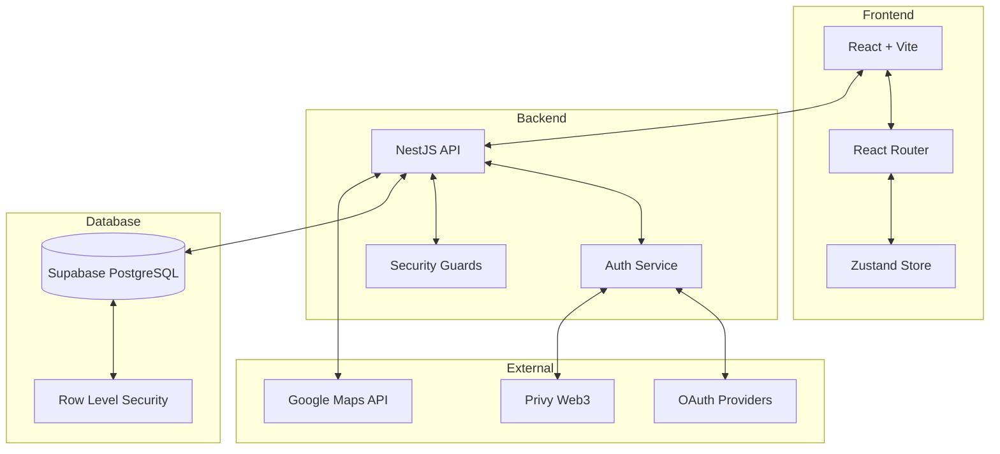
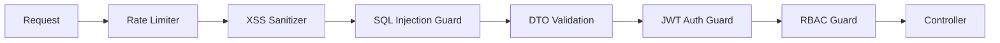
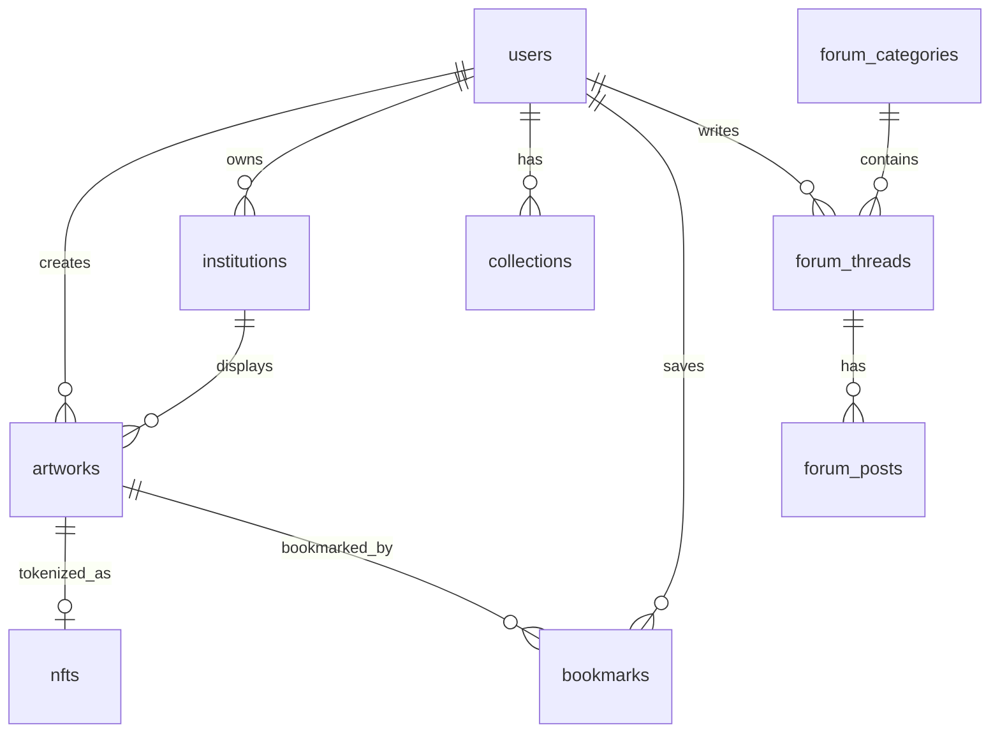

# System Architecture

## 1. High-Level Overview

Seniqu is an enterprise-grade **Indonesian Art Gallery & NFT Marketplace** platform. It utilizes a modern **Monorepo-style** structure separating the Client (Frontend) and Server (Backend), designed for scalability, performance, security, and maintainability.

### Architecture Diagram



## 2. Technology Stack

### **Frontend**

| Technology | Purpose |
|------------|---------|
| React 18 | Core UI framework |
| Vite | Build tool with HMR |
| TypeScript | Type-safe development |
| Tailwind CSS | Utility-first styling |
| Zustand | Lightweight state management |
| React Router v6 | Client-side routing |
| Framer Motion | Animations |
| Recharts | Data visualization |
| Lucide React | Icon library |

### **Backend**

| Technology | Purpose |
|------------|---------|
| NestJS | Progressive Node.js framework |
| TypeScript | Type-safe development |
| Passport.js | Authentication (JWT, OAuth, Privy) |
| class-validator | DTO validation |
| Swagger | API documentation |
| Helmet | Security headers |
| Throttler | Rate limiting |

### **Database**

| Technology | Purpose |
|------------|---------|
| Supabase | PostgreSQL with auto-scaling |
| PostGIS | Geolocation queries |
| Row Level Security | Data access control |

## 3. Directory Structure

```
seniqu-webapp/
├── backend/                    # NestJS Server Application
│   ├── src/
│   │   ├── main.ts            # Entry point with security config
│   │   ├── app.module.ts      # Root module
│   │   │
│   │   ├── common/            # Shared utilities
│   │   │   ├── decorators/    # @GetUser, @Roles, @Public
│   │   │   ├── filters/       # HttpExceptionFilter
│   │   │   ├── guards/        # JwtAuthGuard, RolesGuard, SqlInjectionGuard
│   │   │   ├── interceptors/  # XssSanitizer, SecurityHeaders
│   │   │   └── middleware/    # RequestId
│   │   │
│   │   ├── auth/              # Authentication module
│   │   ├── users/             # User management
│   │   ├── artworks/          # Artwork CRUD
│   │   ├── nfts/              # NFT marketplace
│   │   ├── collections/       # User collections
│   │   ├── museums/           # Museums & galleries
│   │   ├── bookmarks/         # User bookmarks
│   │   ├── forum/             # Community forum
│   │   ├── search/            # Global search
│   │   ├── analytics/         # Dashboard analytics
│   │   ├── audit/             # Security audit logging
│   │   ├── notifications/     # User notifications
│   │   ├── governance/        # DAO governance
│   │   └── admin/             # Admin dashboard
│   │
│   └── supabase/
│       └── migrations/        # SQL schema & functions
│           ├── 001_initial_schema.sql
│           ├── 002_functions.sql
│           ├── 003_security_policies.sql
│           └── 004_indexes.sql
│
├── frontend/                   # React Client Application
│   ├── src/
│   │   ├── main.tsx           # Entry point
│   │   ├── App.tsx            # Root component
│   │   │
│   │   ├── components/
│   │   │   ├── common/        # Layouts, Loaders, ProtectedRoute
│   │   │   └── ui/            # Design System components
│   │   │
│   │   ├── features/          # Feature modules
│   │   │   ├── admin/         # Super admin dashboard
│   │   │   ├── ai/            # AI genre detection
│   │   │   ├── artist/        # Artist/institution dashboard
│   │   │   ├── auth/          # Login, Register, OAuth
│   │   │   ├── community/     # Forum
│   │   │   ├── gallery/       # Public gallery
│   │   │   ├── marketplace/   # NFT marketplace
│   │   │   └── user/          # User dashboard
│   │   │
│   │   ├── hooks/             # Custom React hooks
│   │   ├── lib/               # Utilities, types, constants
│   │   ├── routes/            # Application routing
│   │   └── stores/            # Zustand global stores
│   │
│   └── public/                # Static assets
│
├── doc/                        # Project documentation
│
└── contracts/                  # Smart Contracts (Future)
```

## 4. Key Design Patterns

### **Feature-Based Architecture (Frontend)**

Features are self-contained modules with their own pages, components, and logic:

```
features/artist/
├── index.tsx              # Feature exports
├── pages/
│   ├── Dashboard.tsx
│   ├── MyArtworks.tsx
│   ├── UploadArtwork.tsx
│   ├── Analytics.tsx
│   └── Settings.tsx
└── components/            # Feature-specific components
```

**Benefits:**
- **Self-Contained**: Each feature is independent
- **Scalable**: Easy to add new features
- **Lazy Loading**: Code splitting per feature

### **Modular Architecture (Backend)**

Each module follows NestJS conventions:

```
museums/
├── museums.module.ts      # Module definition
├── museums.controller.ts  # HTTP endpoints
├── museums.service.ts     # Business logic
└── dto/
    ├── create-museum.dto.ts
    └── search-museum.dto.ts
```

### **Security Layers**



## 5. Database Schema Overview



## 6. Scalability Considerations

| Aspect | Implementation |
|--------|----------------|
| **Code Splitting** | Lazy-loaded routes via `React.lazy` |
| **Database** | Supabase with connection pooling |
| **Caching** | React Query for server state |
| **Rate Limiting** | 3-tier throttling (10/50/100 RPM) |
| **Indexes** | Composite, partial, and GIN indexes |
| **CDN** | Static assets via CDN |

## 7. Security Compliance

### OWASP Top 10 Mitigations

| Vulnerability | Mitigation |
|---------------|------------|
| **Injection** | Parameterized queries, SQL injection guard |
| **Broken Auth** | JWT + refresh tokens, account lockout |
| **XSS** | Input sanitization, CSP headers |
| **CSRF** | SameSite cookies, CORS restrictions |
| **Security Misconfig** | Helmet headers, env validation |
| **Broken Access Control** | RBAC + Row Level Security |
| **Logging** | Comprehensive audit trail |
