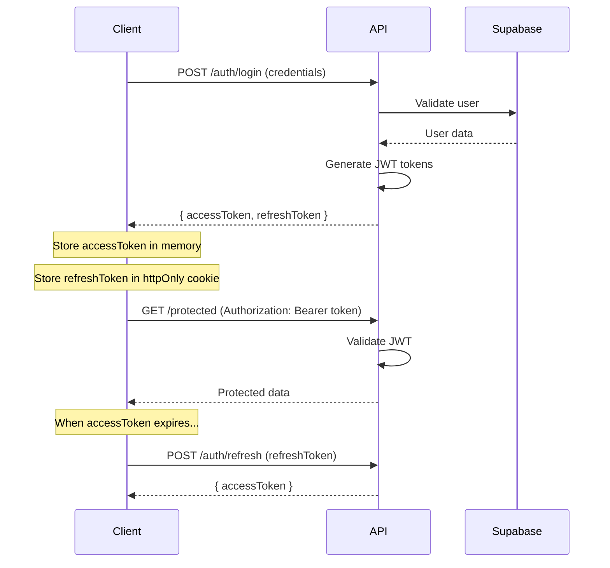
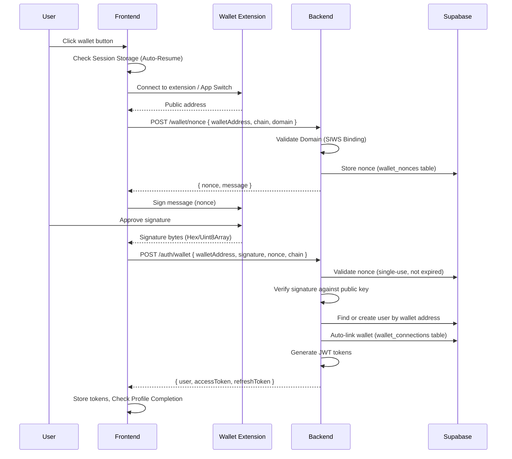
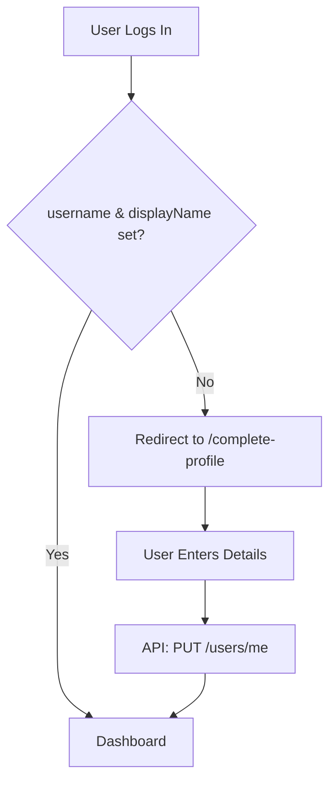
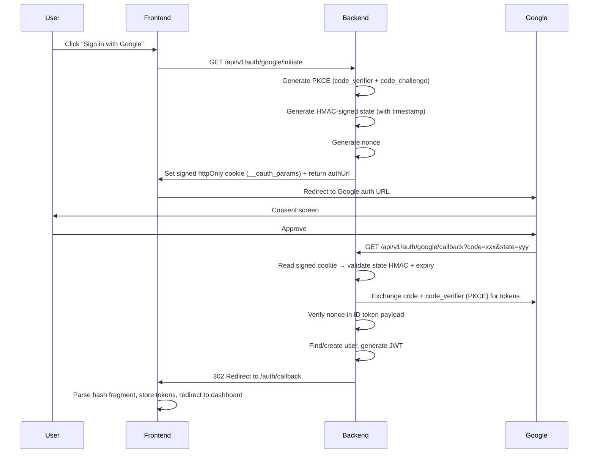
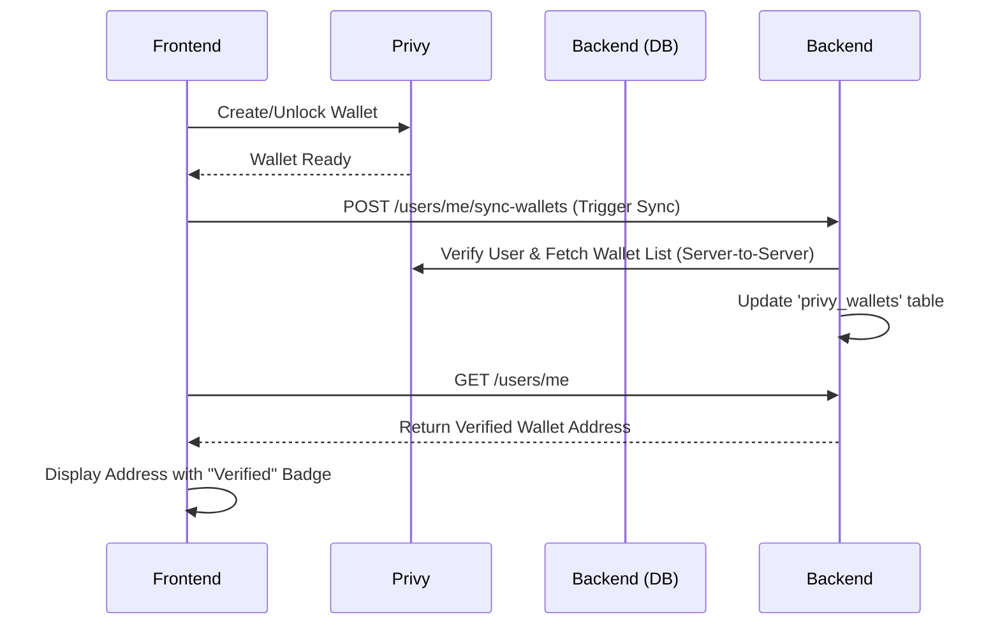
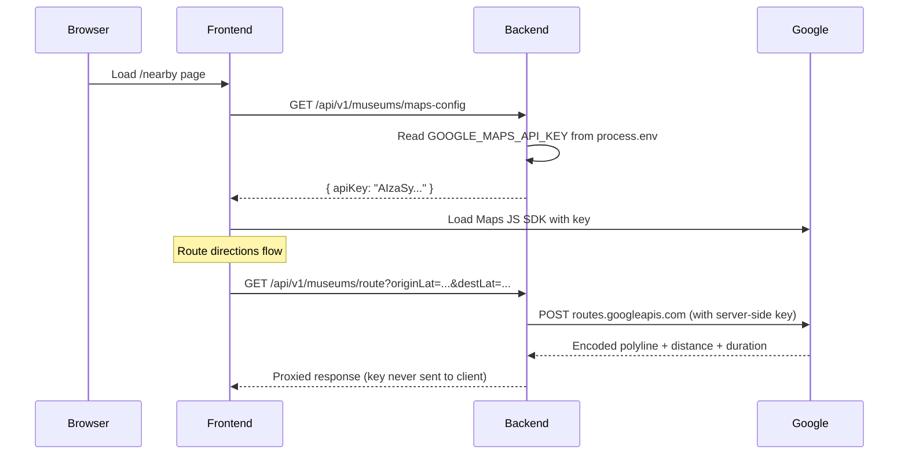

# Authentication & Security Architecture

## 1. Authentication System

Seniqu implements a robust multi-strategy authentication system with enterprise-grade security measures, supporting both traditional and Web3 wallet-based authentication.

### 1.1 Supported Authentication Methods

| Method | Status | Description |
|--------|--------|-------------|
| **Email/Password** | ✅ Active | Traditional login with bcrypt hashing |
| **Google OAuth 2.0** | ✅ Active | Social login via Google (PKCE + HMAC state) |
| **Manual Wallet (Desktop)** | ✅ Active | Direct connection via browser extension (MetaMask, Phantom) |
| **Reown / WalletConnect (Mobile)** | ✅ Active | Mobile-optimized wallet picker (Solana + EVM) via AppKit |
| **Privy Embedded Wallet** | ✅ Active | Auto-created non-custodial wallets for all users |

### 1.2 JWT Token Flow



### 1.3 Hybrid Wallet Strategy

Seniqu employs a **Hybrid Wallet Strategy** to optimize user experience across devices while bypassing third-party restrictions:

1.  **Desktop (Browser Extensions)**:
    *   **Direct Connection**: Uses `window.ethereum` (MetaMask) or `window.solana` (Phantom) directly.
    *   **Reason**: Bypasses Privy's UI for a faster, native feel. Avoids "Coinbase Wallet" interference by strictly filtering providers.
    *   **Auto-Connect**: Strictly disabled (`shouldAutoConnect: false`) and removed from Privy's `walletList` configuration to prevent *any* unsolicited wallet popups on page load.
    *   **Flow**: Connect → Request Nonce (with Domain) → Sign → Verify.

2.  **Mobile (Reown / WalletConnect)**:
    *   **AppKit Modal**: Uses Reown AppKit for a unified mobile wallet picker.
    *   **Configuration**:
        *   **Socials Disabled**: Email/Social logins hidden to prevent clutter.
        *   **Multi-Chain**: Supports both Solana and EVM (Ethereum) wallets via `EthersAdapter`.
    *   **Reason**: Best-in-class mobile experience for deep linking to wallet apps.

### 1.4 Manual Wallet Authentication Flow (Desktop & Mobile)

Direct wallet-to-backend authentication bypasses third-party SDKs for wallet login. The flow uses cryptographic signature verification and single-use nonces.



**Mobile Enhancements:**
-   **Session Persistence**: The frontend persists the connection state in `sessionStorage` to handle app switching (deep linking).
-   **Auto-Resume**: On return to the app, the connection flow automatically resumes if a pending attempt is detected.

### 1.5 Mandatory Profile Completion

After *any* successful login (Email, Google, or Wallet), the system enforces a profile completion check.



- **Trigger**: `needsProfileCompletion(user)` helper in frontend.
- **Requirement**: `username` (unique) and `displayName` must be present.
- **Route**: `/complete-profile` (standalone page).

**Security features:**

| Feature | Implementation |
|---------|----------------|
| **Single-use nonces** | Nonce marked `is_used = TRUE` after verification, expires in 5 min |
| **Signature verification** | Ed25519 (Solana) or EIP-191 (Ethereum) signature checked server-side |
| **Rate limiting** | 5 connect + 3 sign attempts per minute (client), server throttle on `/auth/wallet` |
| **Anti-replay** | Nonce cannot be reused; `wallet_nonces` table enforces uniqueness |
| **Sanitized errors** | Internal errors never leak stack traces; user rejections detected separately |

### 1.6 Google OAuth Server-Side Callback Flow (Hardened)

Google OAuth uses a fully hardened **server-side** pattern with PKCE, HMAC-signed state, and nonce verification.



**Security features:**

| Feature | Implementation |
|---------|----------------|
| **PKCE** | `code_verifier` + `code_challenge` (SHA-256, RFC 7636) generated server-side |
| **State** | HMAC-SHA256 signed with embedded timestamp, 10-minute expiry, timing-safe comparison |
| **Nonce** | Random UUID verified against Google ID token `nonce` claim to prevent replay attacks |
| **Cookie** | Signed httpOnly, Secure, SameSite=Lax — client JS cannot read or tamper |
| **Cleanup** | Cookie cleared after every callback, regardless of success or failure |
| **Response Format Preservation** | NestJS `TransformInterceptor` dynamically detects 3xx status codes and `@Res()` handlers (returning undefined/null) to bypass `{ success: true, data: ... }` JSON wrapping on redirect requests |
| **Resilience & Fail-Safe** | Multilayered safety net with outer try-catch guarantees a `302 Redirect` is always sent to the frontend with an encoded error parameter in the URL hash, preventing blank/hung screens |
| **Non-blocking Wallet Provisioning** | Background/fire-and-forget sync/provisioning pattern for Privy embedded wallets prevents server latency or timeouts from blocking user authentication |

### 1.7 Privy Embedded Wallet (Auto-Sync & Verification)

Users who sign in via Web2 methods (Email, Google) automatically get a non-custodial embedded wallet powered by Privy.

- **Mechanism**: `PrivySyncManager` uses `useSyncJwtBasedAuthState` to keep the Privy session in sync.
- **Backend Verification**: The backend treats the `privy_wallets` table as the **Single Source of Truth**.
  - Client-side wallet addresses are *never* blindly trusted for display or critical operations.
  - The frontend pulls the wallet address from `GET /users/me` (populated from DB) to prevent UI spoofing.
- **Anti-Throttling**: The `POST /users/me/sync-wallets` endpoint is used to explicitly sync Privy's state to our DB. This call is:
  - **Debounced**: 1.5s delay to prevent spamming on mount.
  - **Cached**: Session storage prevents redundant calls within 60 seconds.



> [!IMPORTANT]
> The embedded wallet is non-custodial — only the user controls the private key via Privy's MPC infrastructure. Seniqu never has access to the private key.

### 1.8 Wallet Anti-Hacking Measures

| Feature | Implementation |
|---------|----------------|
| **Source of Truth** | UI displays strictly what is in the DB, not what is in the browser local state. |
| **Verification Badges** | Green "Verified by Seniqu" badge only appears if address matches DB record. |
| **RPC Standardization** | All wallet operations forced to Mainnet (or Env RPC) to prevent "Devnet Scams" where users are tricked into sending real funds to devnet addresses. |

### 1.9 Email Verification & OTP Login (Brevo Integration)

Seniqu uses Brevo SMTP for transactional emails, including Registration Verification and One-Time Passwords (OTP) for login. The architecture ensures that email delivery is reliable and that the verification process is secure against brute-force and throttling attacks.

#### 1.9.1 Registration Verification Flow
1. **Initiation**: User registers via email/password.
2. **Token Generation**: A cryptographically secure random 6-digit OTP is generated.
3. **Storage**: The OTP is hashed (using bcrypt) and stored in the database (`verification_token` column) along with an expiration timestamp (`verification_expires`, typically 15 minutes).
4. **Email Dispatch**: The plaintext OTP is sent to the user via Brevo SMTP.
5. **Verification**: The user submits the OTP. The system verifies it against the hashed token. If successful, `is_verified` becomes `true` and the token is cleared.

#### 1.9.2 OTP Login Flow
For passwordless authentication or as a fallback:
1. User requests OTP login.
2. System verifies the email exists.
3. Generates, hashes, and stores a 6-digit OTP (valid for 5 minutes).
4. Sends email via Brevo.
5. User submits OTP -> System verifies -> Issues JWT.

#### 1.9.3 Anti-Throttling & Anti-Hacking Measures for Email

| Threat | Mitigation Strategy |
|--------|---------------------|
| **Brute Force (OTP Guessing)** | OTPs are 6 digits. After 3 failed attempts, the OTP is invalidated, and the user must request a new one. |
| **Spam / Throttling** | The API limits OTP request endpoints (`/auth/request-otp`, `/auth/resend-verification`) to 1 request per 60 seconds per IP/Email. |
| **Timing Attacks** | Constant-time comparison is used when verifying hashed tokens. |
| **Database Leaks** | Tokens are stored as bcrypt hashes. A compromised database does not reveal active plaintext OTPs. |

### 1.10 Key Management & Incident Response (Key Leaks)

Seniqu enforces a strict policy of **Zero Hardcoded Secrets**. All API keys (Brevo, Privy, Supabase) must be injected via environment variables and accessed strictly through NestJS's `ConfigService`.

**Past Incident (Privy Key Leak)**:
During development, a Privy App Secret was pushed to the git repository. The incident was handled by:
1. **Immediate Revocation**: The leaked key was revoked in the Privy Developer Dashboard.
2. **Key Rotation**: New keys were generated and injected via `.env`.
3. **Codebase Cleanup**: The `privy.service.ts` was refactored to use `ConfigService`.

For a comprehensive guide on handling Key Leaks, refer to the dedicated [Security Incident Response Document](./11-Security-Incident-Response.md).

### 1.11 Token Configuration

```typescript
JWT_SECRET=your-super-secret-jwt-key-min-32-chars
JWT_EXPIRES_IN=15m                    // Access token: 15 minutes
JWT_REFRESH_SECRET=your-refresh-secret
JWT_REFRESH_EXPIRES_IN=7d             // Refresh token: 7 days
```

### 1.12 Google Maps API Key Security

The Google Maps JavaScript API key requires special handling because it must be delivered to the browser for map rendering, but must not be statically embedded in the frontend JavaScript bundle.

**Architecture:**



**Security measures:**

| Measure | Implementation |
|---------|----------------|
| **No Static Bundle Embedding** | API key is fetched at runtime via `GET /museums/maps-config`, never in `import.meta.env` for the nearby page |
| **Rate-Limited Delivery** | Endpoint throttled to 30 req/60s via `@Throttle` |
| **Route Proxy** | Route direction queries go through backend proxy (`/museums/route`), so the API key never appears in client-side network requests to Google |
| **Environment Isolation** | `GOOGLE_MAPS_API_KEY` stored in `backend/.env`, which is in `.gitignore` and has never been committed |
| **Git History Audit** | Verified with `git log --all -- backend/.env` — zero commits found |
| **Frontend .env Separation** | Frontend `.env` contains only public-safe keys (Privy App ID, WalletConnect Project ID, API URL) |

**Audit Results (2026-05-21):**
- ✅ No hardcoded `AIzaSy*` patterns found in any `.ts`, `.tsx`, or `.js` file
- ✅ No `GOCSPX-*`, `eyJhbG*`, or `xsmtpsib-*` credential patterns in frontend source
- ✅ All `.env`, `.env.local`, `.env.production`, `.env.test` patterns are in `.gitignore`
- ✅ Zero git history entries for any `.env` file (backend or frontend)
- ✅ Google OAuth Client ID (public) is appropriately in frontend `.env` — this is safe per Google's documentation

### 1.13 DNS Preference Workaround (IPv4First)

During backend integration in dual-stack (IPv4/IPv6) local network environments, outbound requests to Google API endpoints (such as `https://oauth2.googleapis.com/token` during the OAuth authorization code exchange) can hang or time out if the system attempts to resolve and route through IPv6 paths first. This issues a `connect ETIMEDOUT` network error.

To resolve this and guarantee robust connectivity:
* **Implementation**: Hardened the NestJS application entrypoint (`backend/src/main.ts`) by setting the default DNS lookup result order to resolve IPv4 addresses first:
  ```typescript
  import * as dns from 'dns';
  dns.setDefaultResultOrder('ipv4first');
  ```
* **Impact**: outbound HTTPS connections to external APIs (Google, Supabase, etc.) avoid unstable IPv6 routes, ensuring zero-latency OAuth callbacks.

### 1.14 Hash Fragment Collision Resolution (Google OAuth vs Spotify Auth)

When both Google OAuth and Spotify Web Playback integrations are active, they both receive authentication callbacks that deliver an `access_token` in the URL hash fragment (`#access_token=...`).
- **Conflict**: The global `SpotifyAuthBridge` (rendered in `GlobalLayout`) intercepts any URL containing a hash with `access_token`, consumes it as a Spotify token, clears the URL hash via `replaceState`, and redirects the user. This preemptively strips the credentials from the URL, causing the Google OAuth callback handler (`AuthCallback` page) to receive an empty hash and fail with a `"No authentication data received"` error.
- **Fix**: Added explicit guard conditions to `SpotifyAuthBridge.tsx` to immediately bypass execution when:
  1. The current route is the Google callback page (`/auth/callback`).
  2. The URL hash contains Google-specific query keys (such as `user` or `refresh_token`).
- **Impact**: Restored flawless execution of Google Social Sign-In and local user logins alongside background Privy wallet provisioning.


## 2. Role-Based Access Control (RBAC)

### 2.1 User Roles

| Role | Capabilities |
|------|--------------| 
| `user` | Browse gallery, view artworks, basic access |
| `collector` | Buy art, create collections, manage bookmarks |
| `artist` | Upload artwork, view analytics, manage profile |
| `institution` | Manage museum/gallery, curate exhibitions |
| `admin` | Content moderation, user management, approvals |
| `super_admin` | Full system access, security center, system logs |

### 2.2 Frontend Implementation

```tsx
// Protected route with role check
<ProtectedRoute roles={[ROLES.ADMIN, ROLES.SUPER_ADMIN]}>
    <AdminDashboard />
</ProtectedRoute>

// Conditional rendering based on role
{user.role === 'artist' && <ArtistTools />}
```

### 2.3 Backend Implementation

```typescript
// Controller protection
@UseGuards(JwtAuthGuard, RolesGuard)
@Roles('admin', 'super_admin')
@Delete('users/:id')
deleteUser(@Param('id') id: string) { }

// Get current user in controller
@Get('profile')
getProfile(@GetUser() user: User) {
    return this.usersService.findById(user.id);
}
```

## 3. Security Measures (OWASP Compliant)

### 3.1 Input Validation

All inputs are validated using class-validator DTOs:

```typescript
export class WalletLoginDto {
    @IsString()
    @IsNotEmpty()
    walletAddress: string;

    @IsString()
    @IsNotEmpty()
    signature: string;

    @IsString()
    @IsNotEmpty()
    nonce: string;

    @IsOptional()
    @IsString()
    @IsIn(['solana', 'ethereum'])
    chain?: string = 'solana';
}
```

### 3.2 XSS Prevention

```typescript
// XssSanitizerInterceptor sanitizes all string inputs
private sanitizeString(str: string): string {
    // Preserves URL-safe characters while encoding attack vectors
    return str
        .replace(/</g, "&lt;")
        .replace(/>/g, "&gt;")
        .replace(/"/g, "&quot;")
        .replace(/'/g, "&#x27;")
        .replace(/`/g, "&#x60;");
}
```

### 3.2.1 Frontend XSS Prevention

Input sanitization utility (`sanitize.ts`) runs on the client-side before sending data to the API:
- Removes `<script>` tags, `javascript:` URIs, and `on*` event handlers.
- Trims whitespace to prevent blank submissions.
- Reclusively sanitizes nested objects.

### 3.3 SQL Injection Prevention

```typescript
// SqlInjectionGuard detects injection patterns
const sqlPatterns = [
    /(\b(SELECT|INSERT|UPDATE|DELETE|DROP|UNION)\b.*\b(FROM|INTO|TABLE)\b)/i,
    /(--|#|\/\*|\*\/)/,
    /(\b(OR|AND)\b\s*\d+\s*=\s*\d+)/i,
    /(;\s*(DROP|DELETE|UPDATE|INSERT))/i,
];
```

Controllers that handle dynamic parameters or search criteria use the `@UseGuards(SqlInjectionGuard)` at the class or method level.

### 3.4 Rate Limiting

```typescript
// Global rate limiting
ThrottlerModule.forRoot({
    throttlers: [
        { name: 'short', ttl: 1000, limit: 10 },   // 10 req/sec
        { name: 'medium', ttl: 10000, limit: 50 }, // 50 req/10sec
        { name: 'long', ttl: 60000, limit: 100 },  // 100 req/min
    ],
})

// Per-endpoint stricter limits for sensitive write operations
@Throttle({ short: { limit: 5, ttl: 1000 } })
@Post('artworks')
createArtwork() { }

@Throttle({ short: { limit: 3, ttl: 1000 } }) // Even stricter for destructive actions
@Delete('artworks/:id')
deleteArtwork() { }
```

### 3.4.1 Client-Side Anti-Chunking
The frontend utilizes a `debounce` utility (300ms) on search inputs (e.g., `MyArtworks.tsx`) and blocks double-submissions using state locks (`isDeletePending`) to prevent network chunking and accidental duplicated requests.

### 3.5 Parameter & Pagination Validation

**1. Strict Resource ID Validation**
All routes accepting resource IDs (`:id`) enforce UUID format using `ParseUUIDPipe` to prevent malformed or malicious queries from reaching the database layer:
```typescript
@Get("profile/:id")
async getProfile(@Param("id", ParseUUIDPipe) id: string) { ... }
```

**2. Pagination Capping**
All endpoints that return lists of data enforce a hard cap on the `limit` parameter to prevent denial-of-service (DoS) via massive database reads:
```typescript
const safeLimit = Math.min(Math.max(limit, 1), 100); // Caps query at 100 records max
```

// Profile Update Rate Limit
@Throttle({ default: { limit: 5, ttl: 60000 } }) // 5 updates per minute
@Patch('me')
updateProfile() { }
```

### 3.5 User Settings Security

New security-focused settings have been added to the user profile:

| Setting | Type | Description |
|---------|------|-------------|
| **Two-Factor Authentication** | `is_two_factor_enabled` (Boolean) | Enforces 2FA for sensitive actions (planned enforcement) |
| **Login Alerts** | `login_alerts_enabled` (Boolean) | Sends email notifications on new device logins |
| **Notification Preferences** | `notification_prefs` (JSONB) | Granular control over Email, Push, and In-App notifications |

### 3.6 Security Headers (Helmet)

```typescript
app.use(helmet({
    contentSecurityPolicy: {
        directives: {
            defaultSrc: ["'self'"],
            scriptSrc: ["'self'"],
            styleSrc: ["'self'", "'unsafe-inline'"],
        },
    },
    crossOriginEmbedderPolicy: true,
    crossOriginOpenerPolicy: true,
    crossOriginResourcePolicy: { policy: "same-origin" },
    referrerPolicy: { policy: "strict-origin-when-cross-origin" },
}));
```

### 3.6 CORS Configuration

```typescript
app.enableCors({
    origin: process.env.CORS_ORIGINS.split(','),
    credentials: true,
    methods: ['GET', 'POST', 'PUT', 'DELETE', 'PATCH'],
    allowedHeaders: ['Content-Type', 'Authorization'],
});
```

## 4. Wallet Security

### 4.1 Nonce Management

| Property | Value |
|----------|-------|
| **Format** | UUID v4 (cryptographically random) |
| **Expiry** | 5 minutes from creation |
| **Usage** | Single-use (marked `is_used` after verification) |
| **Storage** | `wallet_nonces` table with RLS |
| **Domain Binding** | Nonce request validated against allowed origins (SIWS) |
| **Cleanup** | `cleanup_expired_nonces()` function runs periodically |

### 4.2 Signature Verification

```typescript
// Solana: Ed25519 signature verification
// Message includes verified domain (e.g. "seniquapp.netlify.app") for SIWS compliance
import nacl from 'tweetnacl';

const isValid = nacl.sign.detached.verify(
    new TextEncoder().encode(message),
    bs58.decode(signature),
    bs58.decode(walletAddress)
);

// Ethereum: EIP-191 personal_sign recovery
import { verifyMessage } from 'ethers';
const recoveredAddress = verifyMessage(message, signature);
const isValid = recoveredAddress.toLowerCase() === walletAddress.toLowerCase();
```

### 4.3 Device Fingerprinting

Wallet connections track device metadata for anomaly detection:

```sql
-- wallet_connections table includes:
connected_from_ip INET,
connected_from_ua TEXT,
device_fingerprint VARCHAR(128)
```

## 5. Audit Logging

### 5.1 Events Logged

| Event Type | Examples |
|------------|----------|
| `authentication` | Login success/failure, password reset, wallet connect |
| `authorization` | Access denied, role elevation |
| `wallet` | Deposit, withdraw, wallet linked/unlinked |
| `data_access` | Sensitive data read/write |
| `security` | Rate limit exceeded, injection attempt, replay attack |
| `admin_action` | User banned, content removed |

## 6. Security Checklist

- [x] JWT with short-lived access tokens
- [x] Refresh token rotation
- [x] Password hashing (bcrypt)
- [x] Rate limiting (3-tier)
- [x] Input validation (DTOs)
- [x] XSS sanitization
- [x] SQL injection prevention
- [x] CORS restrictions
- [x] Security headers (Helmet)
- [x] Audit logging
- [x] Account lockout
- [x] Row Level Security
- [x] Role-based access control
- [x] OAuth server-side callback (Google)
- [x] OAuth state parameter (CSRF protection)
- [x] Manual wallet signature verification
- [x] Single-use nonce anti-replay protection
- [x] Device fingerprinting for wallet sessions
- [x] Wallet connection rate limiting (with mobile persistence)
- [x] Google Maps API key — runtime delivery, never in static bundle
- [x] Route directions proxy — API key never sent to client
- [x] Environment files (.env) — gitignored, never committed
- [x] Git history audit — zero .env commits verified
- [ ] Two-factor authentication (planned)
