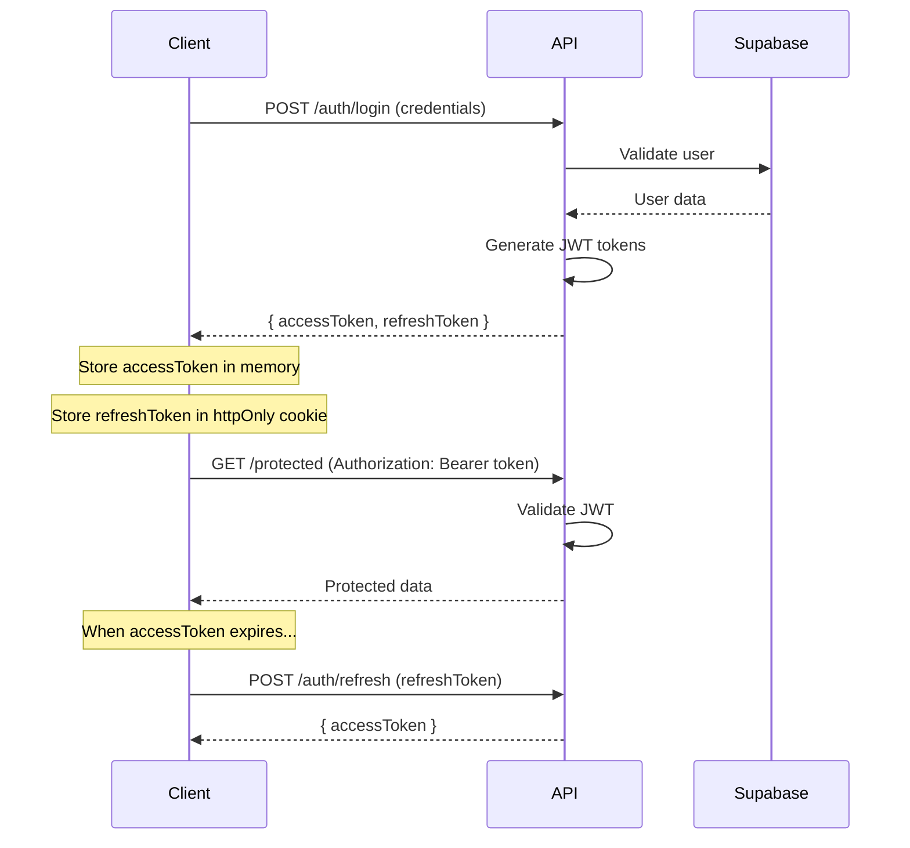
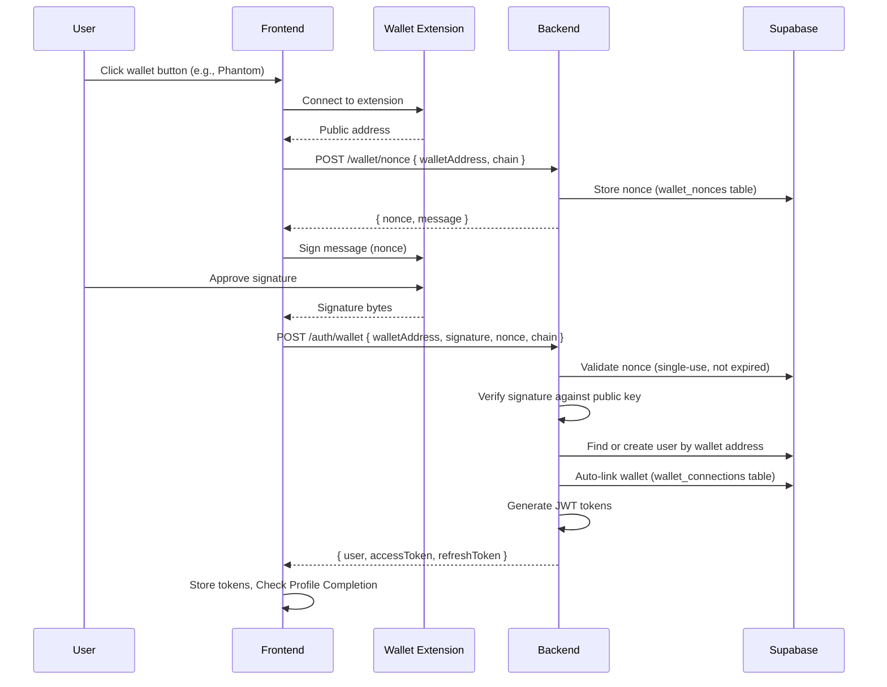
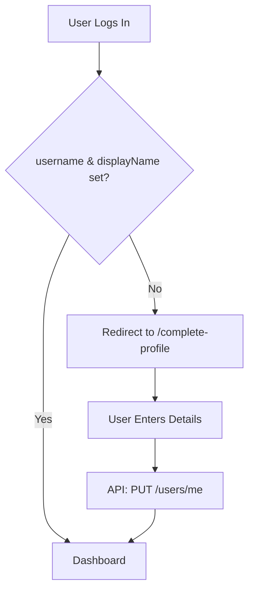
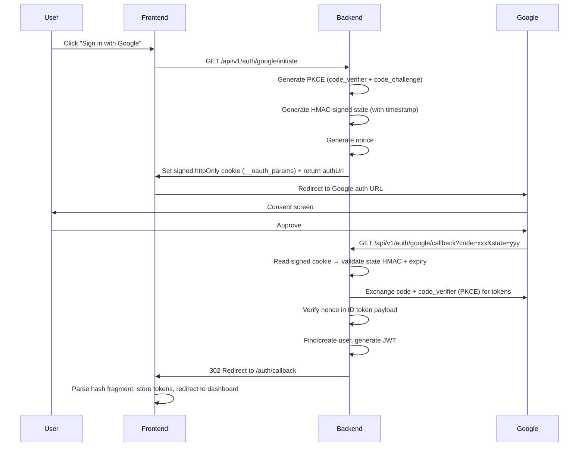
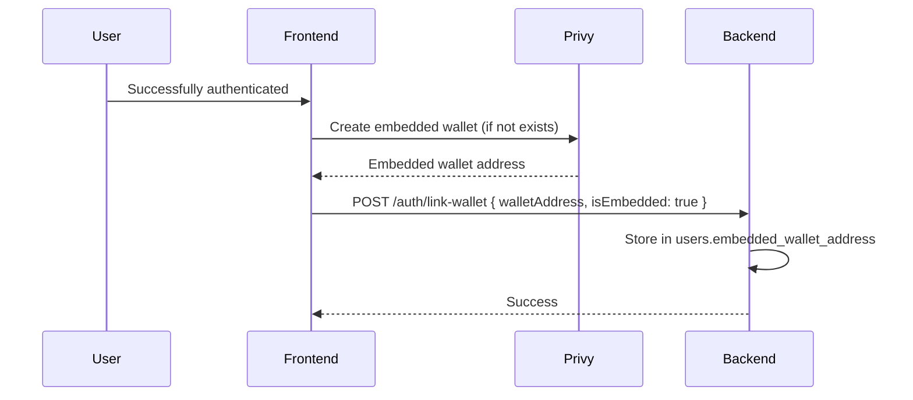

# Authentication & Security Architecture

## 1. Authentication System

Seniqu implements a robust multi-strategy authentication system with enterprise-grade security measures, supporting both traditional and Web3 wallet-based authentication.

### 1.1 Supported Authentication Methods

| Method | Status | Description |
|--------|--------|-------------|
| **Email/Password** | ✅ Active | Traditional login with bcrypt hashing |
| **Google OAuth 2.0** | ✅ Active | Social login via Google (PKCE + HMAC state) |
| **Manual Wallet (Desktop)** | ✅ Active | Direct connection via browser extension (MetaMask, Phantom) |
| **Reown / WalletConnect (Mobile)** | ✅ Active | Mobile-optimized wallet picker (Solana + EVM) via AppKit |
| **Privy Embedded Wallet** | ✅ Active | Auto-created non-custodial wallets for all users |

### 1.2 JWT Token Flow



### 1.3 Hybrid Wallet Strategy

Seniqu employs a **Hybrid Wallet Strategy** to optimize user experience across devices while bypassing third-party restrictions:

1.  **Desktop (Browser Extensions)**:
    *   **Direct Connection**: Uses `window.ethereum` (MetaMask) or `window.solana` (Phantom) directly.
    *   **Reason**: Bypasses Privy's UI for a faster, native feel. Avoids "Coinbase Wallet" interference by strictly filtering providers.
    *   **Flow**: Connect → Request Nonce → Sign → Verify.

2.  **Mobile (Reown / WalletConnect)**:
    *   **AppKit Modal**: Uses Reown AppKit for a unified mobile wallet picker.
    *   **Configuration**:
        *   **Socials Disabled**: Email/Social logins hidden to prevent clutter.
        *   **Multi-Chain**: Supports both Solana and EVM (Ethereum) wallets via `EthersAdapter`.
    *   **Reason**: Best-in-class mobile experience for deep linking to wallet apps.

### 1.4 Manual Wallet Authentication Flow (Desktop)

Direct wallet-to-backend authentication bypasses third-party SDKs for wallet login. The flow uses cryptographic signature verification and single-use nonces.



### 1.5 Mandatory Profile Completion

After *any* successful login (Email, Google, or Wallet), the system enforces a profile completion check.



- **Trigger**: `needsProfileCompletion(user)` helper in frontend.
- **Requirement**: `username` (unique) and `displayName` must be present.
- **Route**: `/complete-profile` (standalone page).

**Security features:**

| Feature | Implementation |
|---------|----------------|
| **Single-use nonces** | Nonce marked `is_used = TRUE` after verification, expires in 5 min |
| **Signature verification** | Ed25519 (Solana) or EIP-191 (Ethereum) signature checked server-side |
| **Rate limiting** | 5 connect + 3 sign attempts per minute (client), server throttle on `/auth/wallet` |
| **Anti-replay** | Nonce cannot be reused; `wallet_nonces` table enforces uniqueness |
| **Sanitized errors** | Internal errors never leak stack traces; user rejections detected separately |

### 1.6 Google OAuth Server-Side Callback Flow (Hardened)

Google OAuth uses a fully hardened **server-side** pattern with PKCE, HMAC-signed state, and nonce verification.



**Security features:**

| Feature | Implementation |
|---------|----------------|
| **PKCE** | `code_verifier` + `code_challenge` (SHA-256, RFC 7636) generated server-side |
| **State** | HMAC-SHA256 signed with embedded timestamp, 10-minute expiry, timing-safe comparison |
| **Nonce** | Random UUID verified against Google ID token `nonce` claim to prevent replay attacks |
| **Cookie** | Signed httpOnly, Secure, SameSite=Lax — client JS cannot read or tamper |
| **Cleanup** | Cookie cleared after every callback, regardless of success or failure |

### 1.7 Privy Embedded Wallet

After any successful authentication (email, Google, or manual wallet), Privy automatically creates a **non-custodial embedded Solana wallet** for the user if one doesn't exist.



> [!IMPORTANT]
> The embedded wallet is non-custodial — only the user controls the private key via Privy's MPC infrastructure. Seniqu never has access to the private key.

### 1.8 Token Configuration

```typescript
JWT_SECRET=your-super-secret-jwt-key-min-32-chars
JWT_EXPIRES_IN=15m                    // Access token: 15 minutes
JWT_REFRESH_SECRET=your-refresh-secret
JWT_REFRESH_EXPIRES_IN=7d             // Refresh token: 7 days
```

## 2. Role-Based Access Control (RBAC)

### 2.1 User Roles

| Role | Capabilities |
|------|--------------|
| `user` | Browse gallery, view artworks, basic access |
| `collector` | Buy art, create collections, manage bookmarks |
| `artist` | Upload artwork, view analytics, manage profile |
| `institution` | Manage museum/gallery, curate exhibitions |
| `admin` | Content moderation, user management, approvals |
| `super_admin` | Full system access, security center, system logs |

### 2.2 Frontend Implementation

```tsx
// Protected route with role check
<ProtectedRoute roles={[ROLES.ADMIN, ROLES.SUPER_ADMIN]}>
    <AdminDashboard />
</ProtectedRoute>

// Conditional rendering based on role
{user.role === 'artist' && <ArtistTools />}
```

### 2.3 Backend Implementation

```typescript
// Controller protection
@UseGuards(JwtAuthGuard, RolesGuard)
@Roles('admin', 'super_admin')
@Delete('users/:id')
deleteUser(@Param('id') id: string) { }

// Get current user in controller
@Get('profile')
getProfile(@GetUser() user: User) {
    return this.usersService.findById(user.id);
}
```

## 3. Security Measures (OWASP Compliant)

### 3.1 Input Validation

All inputs are validated using class-validator DTOs:

```typescript
export class WalletLoginDto {
    @IsString()
    @IsNotEmpty()
    walletAddress: string;

    @IsString()
    @IsNotEmpty()
    signature: string;

    @IsString()
    @IsNotEmpty()
    nonce: string;

    @IsOptional()
    @IsString()
    @IsIn(['solana', 'ethereum'])
    chain?: string = 'solana';
}
```

### 3.2 XSS Prevention

```typescript
// XssSanitizerInterceptor sanitizes all string inputs
private sanitizeString(str: string): string {
    return str
        .replace(/&/g, "&amp;")
        .replace(/</g, "&lt;")
        .replace(/>/g, "&gt;")
        .replace(/"/g, "&quot;")
        .replace(/'/g, "&#x27;");
}
```

### 3.3 SQL Injection Prevention

```typescript
// SqlInjectionGuard detects injection patterns
const sqlPatterns = [
    /(\b(SELECT|INSERT|UPDATE|DELETE|DROP|UNION)\b.*\b(FROM|INTO|TABLE)\b)/i,
    /(--|#|\/\*|\*\/)/,
    /(\b(OR|AND)\b\s*\d+\s*=\s*\d+)/i,
    /(;\s*(DROP|DELETE|UPDATE|INSERT))/i,
];
```

### 3.4 Rate Limiting

```typescript
// Global rate limiting
ThrottlerModule.forRoot({
    throttlers: [
        { name: 'short', ttl: 1000, limit: 10 },   // 10 req/sec
        { name: 'medium', ttl: 10000, limit: 50 }, // 50 req/10sec
        { name: 'long', ttl: 60000, limit: 100 },  // 100 req/min
    ],
})

// Per-endpoint stricter limits
@Throttle({ short: { limit: 3, ttl: 1000 } })
@Post('login')
login() { }
```

### 3.5 Security Headers (Helmet)

```typescript
app.use(helmet({
    contentSecurityPolicy: {
        directives: {
            defaultSrc: ["'self'"],
            scriptSrc: ["'self'"],
            styleSrc: ["'self'", "'unsafe-inline'"],
        },
    },
    crossOriginEmbedderPolicy: true,
    crossOriginOpenerPolicy: true,
    crossOriginResourcePolicy: { policy: "same-origin" },
    referrerPolicy: { policy: "strict-origin-when-cross-origin" },
}));
```

### 3.6 CORS Configuration

```typescript
app.enableCors({
    origin: process.env.CORS_ORIGINS.split(','),
    credentials: true,
    methods: ['GET', 'POST', 'PUT', 'DELETE', 'PATCH'],
    allowedHeaders: ['Content-Type', 'Authorization'],
});
```

## 4. Wallet Security

### 4.1 Nonce Management

| Property | Value |
|----------|-------|
| **Format** | UUID v4 (cryptographically random) |
| **Expiry** | 5 minutes from creation |
| **Usage** | Single-use (marked `is_used` after verification) |
| **Storage** | `wallet_nonces` table with RLS |
| **Cleanup** | `cleanup_expired_nonces()` function runs periodically |

### 4.2 Signature Verification

```typescript
// Solana: Ed25519 signature verification
import nacl from 'tweetnacl';

const isValid = nacl.sign.detached.verify(
    new TextEncoder().encode(message),
    bs58.decode(signature),
    bs58.decode(walletAddress)
);

// Ethereum: EIP-191 personal_sign recovery
import { verifyMessage } from 'ethers';
const recoveredAddress = verifyMessage(message, signature);
const isValid = recoveredAddress.toLowerCase() === walletAddress.toLowerCase();
```

### 4.3 Device Fingerprinting

Wallet connections track device metadata for anomaly detection:

```sql
-- wallet_connections table includes:
connected_from_ip INET,
connected_from_ua TEXT,
device_fingerprint VARCHAR(128)
```

## 5. Audit Logging

### 5.1 Events Logged

| Event Type | Examples |
|------------|----------|
| `authentication` | Login success/failure, password reset, wallet connect |
| `authorization` | Access denied, role elevation |
| `wallet` | Deposit, withdraw, wallet linked/unlinked |
| `data_access` | Sensitive data read/write |
| `security` | Rate limit exceeded, injection attempt, replay attack |
| `admin_action` | User banned, content removed |

## 6. Security Checklist

- [x] JWT with short-lived access tokens
- [x] Refresh token rotation
- [x] Password hashing (bcrypt)
- [x] Rate limiting (3-tier)
- [x] Input validation (DTOs)
- [x] XSS sanitization
- [x] SQL injection prevention
- [x] CORS restrictions
- [x] Security headers (Helmet)
- [x] Audit logging
- [x] Account lockout
- [x] Row Level Security
- [x] Role-based access control
- [x] OAuth server-side callback (Google)
- [x] OAuth state parameter (CSRF protection)
- [x] Manual wallet signature verification
- [x] Single-use nonce anti-replay protection
- [x] Device fingerprinting for wallet sessions
- [x] Wallet connection rate limiting
- [ ] Two-factor authentication (planned)
