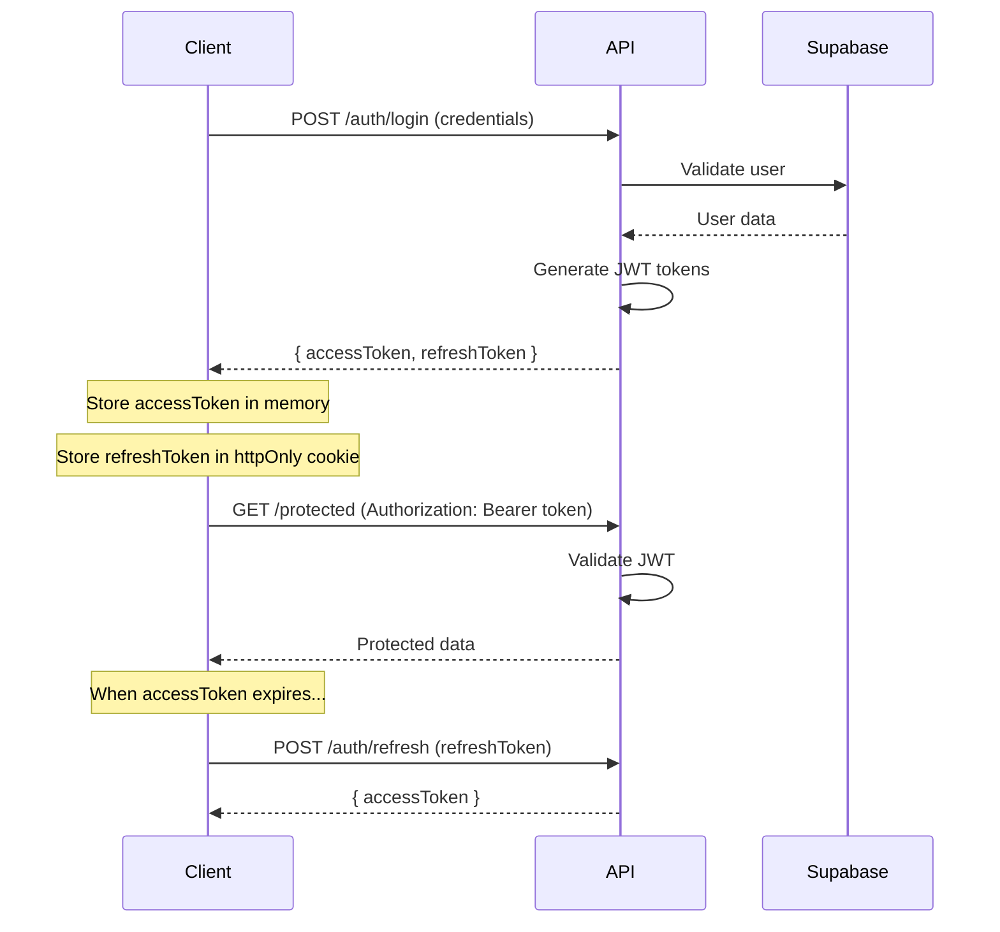
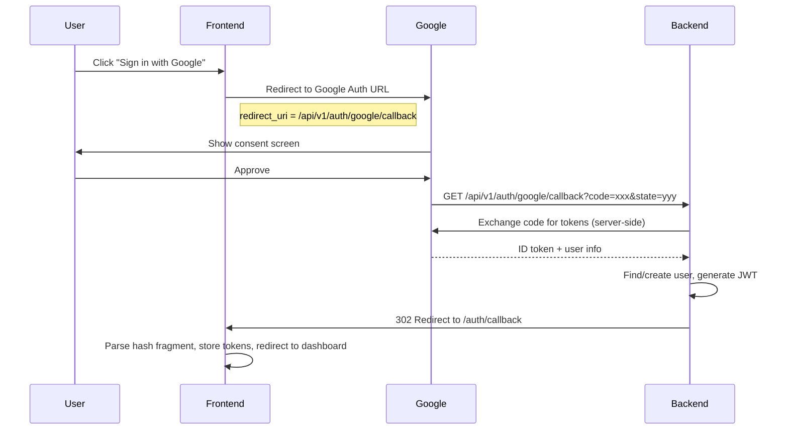

# Authentication & Security Architecture

## 1. Authentication System

Seniqu implements a robust multi-strategy authentication system with enterprise-grade security measures.

### 1.1 Supported Authentication Methods

| Method | Status | Description |
|--------|--------|-------------|
| **Email/Password** | ✅ Active | Traditional login with bcrypt hashing |
| **Google OAuth 2.0** | ✅ Active | Social login via Google |
| **GitHub OAuth 2.0** | ✅ Active | Developer-friendly OAuth |
| **Privy Web3** | ✅ Active | Wallet-based authentication |

### 1.2 JWT Token Flow



### 1.3 Google OAuth Server-Side Callback Flow

Google OAuth uses a **server-side callback** pattern. The backend handles the code exchange directly, keeping the client secret secure.



**Key details:**
- `redirect_uri` points to the **backend** (`/api/v1/auth/google/callback`), not the frontend
- Tokens are passed to the frontend via **URL hash fragments** (never sent to server in subsequent requests)
- The frontend parses the hash, stores tokens, and cleans the URL
- `GOOGLE_CALLBACK_URL` and `FRONTEND_URL` must be set in backend `.env`

### 1.3 Token Configuration

```typescript
JWT_SECRET=your-super-secret-jwt-key-min-32-chars
JWT_EXPIRES_IN=15m                    // Access token: 15 minutes
JWT_REFRESH_SECRET=your-refresh-secret
JWT_REFRESH_EXPIRES_IN=7d             // Refresh token: 7 days
```

## 2. Role-Based Access Control (RBAC)

### 2.1 User Roles

| Role | Capabilities |
|------|--------------|
| `art_lover` | Browse gallery, view artworks, basic access |
| `collector` | Buy art, create collections, manage bookmarks |
| `artist` | Upload artwork, view analytics, manage profile |
| `institution` | Manage museum/gallery, curate exhibitions |
| `admin` | Content moderation, user management, approvals |
| `super_admin` | Full system access, security center, system logs |

### 2.2 Admin Roles (Granular)

| Admin Role | Permissions |
|------------|-------------|
| `content_moderator` | Review & approve artworks |
| `user_manager` | Manage user accounts |
| `system_admin` | Server configuration |
| `security_admin` | Security logs, threat response |
| `super_admin` | All permissions |

### 2.3 Frontend Implementation

```tsx
// Protected route with role check
<ProtectedRoute roles={[ROLES.ADMIN, ROLES.SUPER_ADMIN]}>
    <AdminDashboard />
</ProtectedRoute>

// Conditional rendering based on role
{user.role === 'artist' && <ArtistTools />}
```

### 2.4 Backend Implementation

```typescript
// Controller protection
@UseGuards(JwtAuthGuard, RolesGuard)
@Roles('admin', 'super_admin')
@Delete('users/:id')
deleteUser(@Param('id') id: string) { }

// Get current user in controller
@Get('profile')
getProfile(@GetUser() user: User) {
    return this.usersService.findById(user.id);
}
```

## 3. Security Measures (OWASP Compliant)

### 3.1 Input Validation

All inputs are validated using class-validator DTOs:

```typescript
export class CreateMuseumDto {
    @IsString()
    @MinLength(3)
    @MaxLength(200)
    @Matches(/^[a-zA-Z0-9\s\-,.'&()]+$/)  // Safe characters only
    name: string;

    @IsEmail()
    @Transform(({ value }) => value.toLowerCase().trim())
    email: string;
}
```

### 3.2 XSS Prevention

```typescript
// XssSanitizerInterceptor sanitizes all string inputs
private sanitizeString(str: string): string {
    return str
        .replace(/&/g, "&amp;")
        .replace(/</g, "&lt;")
        .replace(/>/g, "&gt;")
        .replace(/"/g, "&quot;")
        .replace(/'/g, "&#x27;");
}
```

### 3.3 SQL Injection Prevention

```typescript
// SqlInjectionGuard detects injection patterns
const sqlPatterns = [
    /(\b(SELECT|INSERT|UPDATE|DELETE|DROP|UNION)\b.*\b(FROM|INTO|TABLE)\b)/i,
    /(--|\#|\/\*|\*\/)/,
    /(\b(OR|AND)\b\s*\d+\s*=\s*\d+)/i,
    /(;\s*(DROP|DELETE|UPDATE|INSERT))/i,
];
```

### 3.4 Rate Limiting

```typescript
// Global rate limiting
ThrottlerModule.forRoot({
    throttlers: [
        { name: 'short', ttl: 1000, limit: 10 },   // 10 req/sec
        { name: 'medium', ttl: 10000, limit: 50 }, // 50 req/10sec
        { name: 'long', ttl: 60000, limit: 100 },  // 100 req/min
    ],
})

// Per-endpoint stricter limits
@Throttle({ short: { limit: 3, ttl: 1000 } })
@Post('login')
login() { }
```

### 3.5 Security Headers (Helmet)

```typescript
// main.ts
app.use(helmet({
    contentSecurityPolicy: {
        directives: {
            defaultSrc: ["'self'"],
            scriptSrc: ["'self'"],
            styleSrc: ["'self'", "'unsafe-inline'"],
        },
    },
    crossOriginEmbedderPolicy: true,
    crossOriginOpenerPolicy: true,
    crossOriginResourcePolicy: { policy: "same-origin" },
    referrerPolicy: { policy: "strict-origin-when-cross-origin" },
}));
```

### 3.6 CORS Configuration

```typescript
app.enableCors({
    origin: process.env.CORS_ORIGINS.split(','),
    credentials: true,
    methods: ['GET', 'POST', 'PUT', 'DELETE', 'PATCH'],
    allowedHeaders: ['Content-Type', 'Authorization'],
});
```

## 4. Audit Logging

### 4.1 Events Logged

| Event Type | Examples |
|------------|----------|
| `authentication` | Login success/failure, password reset |
| `authorization` | Access denied, role elevation |
| `data_access` | Sensitive data read/write |
| `security` | Rate limit exceeded, injection attempt |
| `admin_action` | User banned, content removed |

### 4.2 Audit Log Schema

```typescript
{
    id: uuid,
    user_id: uuid | null,
    event_type: 'authentication' | 'authorization' | ...,
    action: 'login_success' | 'login_failure' | ...,
    resource_type: 'user' | 'artwork' | ...,
    resource_id: uuid | null,
    ip_address: inet,
    user_agent: string,
    metadata: jsonb,
    created_at: timestamp,
}
```

### 4.3 Usage

```typescript
// Automatic audit logging
@Injectable()
export class AuditService {
    async logAuthEvent(type: 'login_success' | 'login_failure', userId, ip) {
        await this.supabase.from('audit_logs').insert({
            event_type: 'authentication',
            action: type,
            user_id: userId,
            ip_address: ip,
        });
    }
}
```

## 5. Account Security

### 5.1 Password Security

- Minimum 8 characters
- bcrypt hashing with salt rounds: 12
- Password comparison with timing-safe functions

### 5.2 Account Lockout

```sql
-- After 5 failed attempts, lock for 15 minutes
UPDATE users 
SET 
    failed_login_attempts = failed_login_attempts + 1,
    locked_until = CASE 
        WHEN failed_login_attempts >= 4 
        THEN NOW() + INTERVAL '15 minutes'
        ELSE locked_until
    END
WHERE email = $1;
```

### 5.3 Session Management

- Sessions stored in database with expiry
- Ability to revoke all sessions on security events
- Session cleanup scheduled job

## 6. Row Level Security (Supabase)

### 6.1 Example Policies

```sql
-- Users can only see their own bookmarks
CREATE POLICY "Users can view own bookmarks"
ON bookmarks FOR SELECT
USING (auth.uid() = user_id);

-- Published artworks are public
CREATE POLICY "Published artworks are viewable"
ON artworks FOR SELECT
USING (status = 'published');

-- Admin bypass
CREATE POLICY "Admins can manage all"
ON artworks FOR ALL
USING (is_admin());
```

## 7. Frontend Security

### 7.1 Protected Storage

```typescript
// Token storage (production)
// - accessToken: In-memory only (Zustand)
// - refreshToken: httpOnly cookie

// Current implementation
const accessToken = sessionStorage.getItem('accessToken');
```

### 7.2 Route Protection

```tsx
export const ProtectedRoute: FC<Props> = ({ children, roles }) => {
    const { user, isAuthenticated, isLoading } = useAuthStore();
    
    if (!isAuthenticated) {
        return <Navigate to="/auth" replace />;
    }
    
    if (roles && !roles.includes(user.role)) {
        return <Navigate to="/unauthorized" replace />;
    }
    
    return children;
};
```

## 8. Security Checklist

- [x] JWT with short-lived access tokens
- [x] Refresh token rotation
- [x] Password hashing (bcrypt)
- [x] Rate limiting (3-tier)
- [x] Input validation (DTOs)
- [x] XSS sanitization
- [x] SQL injection prevention
- [x] CORS restrictions
- [x] Security headers (Helmet)
- [x] Audit logging
- [x] Account lockout
- [x] Row Level Security
- [x] Role-based access control
- [x] OAuth server-side callback (Google)
- [x] OAuth state parameter (CSRF protection)
- [ ] Two-factor authentication (planned)
