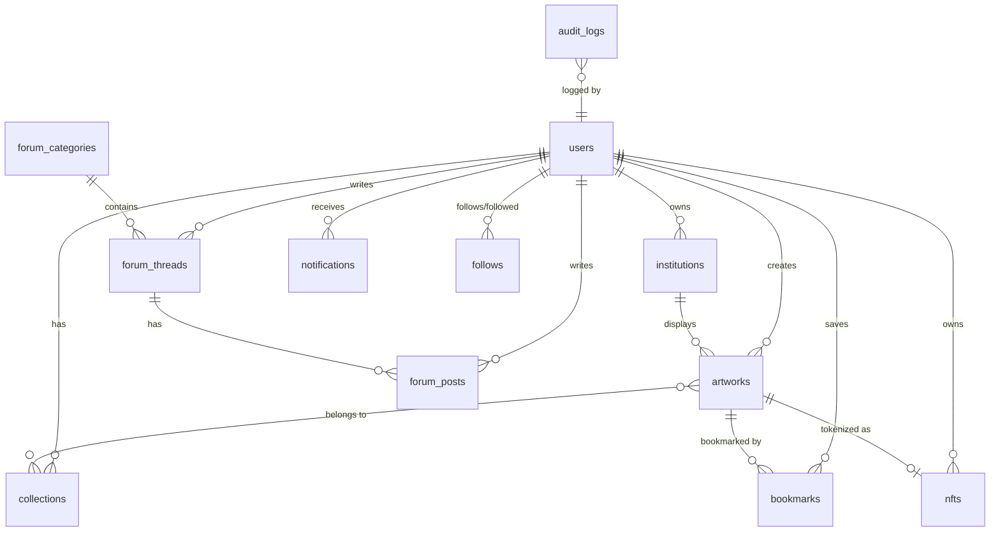

# Database Schema Documentation

## 1. Overview

Seniqu uses **Supabase** (PostgreSQL) as the primary database with advanced features including:

- **PostGIS** for geolocation queries
- **Row Level Security (RLS)** for data access control
- **Full-text search** with `pg_trgm` extension
- **Audit logging** for security compliance

## 2. Schema Migrations

SQL migrations are located in `backend/supabase/migrations/`:

| File | Description |
|------|-------------|
| `001_initial_schema.sql` | Tables, types, triggers, base RLS |
| `002_functions.sql` | PostgreSQL functions |
| `003_security_policies.sql` | Comprehensive RLS policies |
| `004_indexes.sql` | Performance optimization indexes |

### Running Migrations

1. Open Supabase Dashboard → SQL Editor
2. Run each migration file in order
3. Verify tables were created in Table Editor

## 3. Custom Types (Enums)

```sql
-- User roles
CREATE TYPE user_role AS ENUM (
    'art_lover', 'collector', 'artist', 'institution', 'admin', 'super_admin'
);

-- Admin roles (granular permissions)
CREATE TYPE admin_role AS ENUM (
    'content_moderator', 'user_manager', 'system_admin', 
    'security_admin', 'super_admin'
);

-- Artwork status
CREATE TYPE artwork_status AS ENUM (
    'draft', 'pending', 'published', 'rejected', 'archived'
);

-- NFT status
CREATE TYPE nft_status AS ENUM (
    'minting', 'minted', 'listed', 'sold', 'burned'
);

-- Institution type
CREATE TYPE institution_type AS ENUM (
    'museum', 'gallery', 'cultural_center', 'foundation', 
    'private_collection', 'auction_house'
);
```

## 4. Core Tables

### 4.1 Users

```sql
CREATE TABLE users (
    id UUID PRIMARY KEY DEFAULT gen_random_uuid(),
    email VARCHAR(255) UNIQUE,
    username VARCHAR(100) UNIQUE,
    password_hash TEXT,
    display_name VARCHAR(200),
    avatar_url TEXT,
    bio TEXT,
    
    -- Role & permissions
    role user_role DEFAULT 'art_lover',
    admin_role admin_role,
    is_premium BOOLEAN DEFAULT FALSE,
    is_active BOOLEAN DEFAULT TRUE,
    is_verified BOOLEAN DEFAULT FALSE,
    
    -- Web3
    wallet_address VARCHAR(100) UNIQUE,
    privy_id VARCHAR(100) UNIQUE,
    
    -- Security
    password_hash TEXT,
    failed_login_attempts INTEGER DEFAULT 0,
    locked_until TIMESTAMPTZ,
    last_login_at TIMESTAMPTZ,
    login_count INTEGER DEFAULT 0,
    
    -- Metadata
    created_at TIMESTAMPTZ DEFAULT NOW(),
    updated_at TIMESTAMPTZ DEFAULT NOW()
);
```

### 4.2 Institutions (Museums/Galleries)

```sql
CREATE TABLE institutions (
    id UUID PRIMARY KEY DEFAULT gen_random_uuid(),
    owner_id UUID REFERENCES users(id) ON DELETE CASCADE,
    
    -- Basic info
    name VARCHAR(200) NOT NULL,
    slug VARCHAR(200) UNIQUE NOT NULL,
    description TEXT,
    type institution_type DEFAULT 'museum',
    
    -- Location (with PostGIS)
    address TEXT,
    city VARCHAR(100),
    province VARCHAR(100),
    country VARCHAR(100) DEFAULT 'Indonesia',
    postal_code VARCHAR(20),
    location GEOGRAPHY(POINT, 4326),  -- Geolocation
    
    -- Contact
    website VARCHAR(500),
    email VARCHAR(255),
    phone VARCHAR(50),
    
    -- Status
    is_verified BOOLEAN DEFAULT FALSE,
    is_featured BOOLEAN DEFAULT FALSE,
    rating DECIMAL(3,2) DEFAULT 0,
    total_artworks INTEGER DEFAULT 0,
    
    -- Media
    logo_url TEXT,
    cover_image_url TEXT,
    gallery_images JSONB DEFAULT '[]',
    
    created_at TIMESTAMPTZ DEFAULT NOW()
);
```

### 4.3 Artworks

```sql
CREATE TABLE artworks (
    id UUID PRIMARY KEY DEFAULT gen_random_uuid(),
    artist_id UUID REFERENCES users(id) ON DELETE CASCADE,
    institution_id UUID REFERENCES institutions(id) ON DELETE SET NULL,
    
    -- Content
    title VARCHAR(300) NOT NULL,
    slug VARCHAR(350) UNIQUE NOT NULL,
    description TEXT,
    story TEXT,
    
    -- Classification
    medium VARCHAR(100),
    style VARCHAR(100),
    year_created INTEGER,
    dimensions VARCHAR(100),
    
    -- AI Detection
    ai_detected_genres JSONB DEFAULT '[]',
    ai_confidence_score DECIMAL(5,4),
    ai_analyzed_at TIMESTAMPTZ,
    
    -- Status
    status artwork_status DEFAULT 'draft',
    is_nft BOOLEAN DEFAULT FALSE,
    is_for_sale BOOLEAN DEFAULT FALSE,
    price DECIMAL(18,2),
    currency VARCHAR(10) DEFAULT 'IDR',
    
    -- Engagement
    views INTEGER DEFAULT 0,
    likes INTEGER DEFAULT 0,
    
    -- Media
    primary_image_url TEXT NOT NULL,
    additional_images JSONB DEFAULT '[]',
    
    created_at TIMESTAMPTZ DEFAULT NOW()
);
```

### 4.4 NFTs

```sql
CREATE TABLE nfts (
    id UUID PRIMARY KEY DEFAULT gen_random_uuid(),
    artwork_id UUID REFERENCES artworks(id) ON DELETE CASCADE,
    creator_id UUID REFERENCES users(id),
    current_owner_id UUID REFERENCES users(id),
    
    -- Blockchain
    token_id VARCHAR(100),
    contract_address VARCHAR(100),
    chain VARCHAR(50) DEFAULT 'polygon',
    transaction_hash VARCHAR(100),
    
    -- Marketplace
    is_listed BOOLEAN DEFAULT FALSE,
    listing_price DECIMAL(18,8),
    royalty_percentage DECIMAL(5,2) DEFAULT 10.00,
    
    -- Status
    status nft_status DEFAULT 'minting',
    minted_at TIMESTAMPTZ,
    
    created_at TIMESTAMPTZ DEFAULT NOW()
);
```

### 4.5 Forum

```sql
-- Categories
CREATE TABLE forum_categories (
    id UUID PRIMARY KEY DEFAULT gen_random_uuid(),
    name VARCHAR(100) NOT NULL,
    slug VARCHAR(100) UNIQUE NOT NULL,
    description TEXT,
    icon VARCHAR(50),
    color VARCHAR(20),
    sort_order INTEGER DEFAULT 0,
    is_active BOOLEAN DEFAULT TRUE,
    thread_count INTEGER DEFAULT 0
);

-- Threads
CREATE TABLE forum_threads (
    id UUID PRIMARY KEY DEFAULT gen_random_uuid(),
    category_id UUID REFERENCES forum_categories(id),
    author_id UUID REFERENCES users(id),
    
    title VARCHAR(300) NOT NULL,
    slug VARCHAR(350) UNIQUE NOT NULL,
    content TEXT NOT NULL,
    tags JSONB DEFAULT '[]',
    
    is_pinned BOOLEAN DEFAULT FALSE,
    is_locked BOOLEAN DEFAULT FALSE,
    view_count INTEGER DEFAULT 0,
    reply_count INTEGER DEFAULT 0,
    
    last_reply_at TIMESTAMPTZ,
    created_at TIMESTAMPTZ DEFAULT NOW()
);

-- Posts (replies)
CREATE TABLE forum_posts (
    id UUID PRIMARY KEY DEFAULT gen_random_uuid(),
    thread_id UUID REFERENCES forum_threads(id) ON DELETE CASCADE,
    author_id UUID REFERENCES users(id),
    parent_id UUID REFERENCES forum_posts(id),  -- For nested replies
    
    content TEXT NOT NULL,
    is_edited BOOLEAN DEFAULT FALSE,
    
    created_at TIMESTAMPTZ DEFAULT NOW()
);
```

### 4.6 Audit Logs

```sql
CREATE TABLE audit_logs (
    id UUID PRIMARY KEY DEFAULT gen_random_uuid(),
    user_id UUID REFERENCES users(id),
    
    event_type VARCHAR(50) NOT NULL,  -- authentication, authorization, etc.
    action VARCHAR(100) NOT NULL,      -- login_success, access_denied, etc.
    
    resource_type VARCHAR(50),
    resource_id UUID,
    
    ip_address INET,
    user_agent TEXT,
    metadata JSONB DEFAULT '{}',
    
    created_at TIMESTAMPTZ DEFAULT NOW()
);

-- Partition by month for performance (optional)
CREATE INDEX idx_audit_logs_time ON audit_logs(created_at);
CREATE INDEX idx_audit_logs_user ON audit_logs(user_id);
CREATE INDEX idx_audit_logs_type ON audit_logs(event_type);
```

## 5. PostgreSQL Functions

### 5.1 Geolocation Search

```sql
-- Find nearby institutions
CREATE OR REPLACE FUNCTION find_nearby_institutions(
    lat DOUBLE PRECISION,
    lng DOUBLE PRECISION,
    radius_km DOUBLE PRECISION DEFAULT 50
)
RETURNS TABLE (
    id UUID,
    name VARCHAR,
    distance_km DOUBLE PRECISION
)
AS $$
BEGIN
    RETURN QUERY
    SELECT 
        i.id, i.name,
        ST_Distance(
            i.location::geography,
            ST_SetSRID(ST_MakePoint(lng, lat), 4326)::geography
        ) / 1000 AS distance_km
    FROM institutions i
    WHERE ST_DWithin(
        i.location::geography,
        ST_SetSRID(ST_MakePoint(lng, lat), 4326)::geography,
        radius_km * 1000
    )
    ORDER BY distance_km;
END;
$$ LANGUAGE plpgsql;
```

### 5.2 Counter Functions

```sql
-- Increment artwork likes
CREATE OR REPLACE FUNCTION increment_artwork_likes(artwork_id UUID)
RETURNS void AS $$
BEGIN
    UPDATE artworks SET likes = likes + 1 WHERE id = artwork_id;
END;
$$ LANGUAGE plpgsql;

-- Increment artwork views
CREATE OR REPLACE FUNCTION increment_artwork_views(artwork_id UUID)
RETURNS void AS $$
BEGIN
    UPDATE artworks SET views = views + 1 WHERE id = artwork_id;
END;
$$ LANGUAGE plpgsql;
```

## 6. Performance Indexes

```sql
-- Composite indexes
CREATE INDEX idx_artworks_search 
ON artworks(status, artist_id, created_at DESC);

-- Partial indexes
CREATE INDEX idx_artworks_published
ON artworks(status, created_at DESC)
WHERE status = 'published';

-- Full-text search
CREATE INDEX idx_artworks_fulltext
ON artworks USING GIN(
    to_tsvector('english', 
        COALESCE(title, '') || ' ' || COALESCE(description, '')
    )
);

-- BRIN for time-series
CREATE INDEX idx_audit_logs_time_brin
ON audit_logs USING BRIN(created_at);
```

## 7. Row Level Security Examples

```sql
-- Enable RLS
ALTER TABLE artworks ENABLE ROW LEVEL SECURITY;

-- Published artworks are public
CREATE POLICY "Published artworks are viewable"
ON artworks FOR SELECT
USING (status = 'published');

-- Artists can manage their own artworks
CREATE POLICY "Artists can manage own artworks"
ON artworks FOR ALL
USING (auth.uid() = artist_id);

-- Admin bypass
CREATE POLICY "Admins can manage all artworks"
ON artworks FOR ALL
USING (is_admin());
```

## 8. Entity Relationship Diagram



## 9. Backup & Maintenance

### Daily Backups

Supabase automatically creates daily backups. For manual backup:

```bash
# Export schema
pg_dump --schema-only $DATABASE_URL > schema.sql

# Export data
pg_dump --data-only $DATABASE_URL > data.sql
```

### Cleanup Jobs

```sql
-- Clean expired sessions
SELECT cleanup_expired_sessions();

-- Archive old audit logs (monthly)
INSERT INTO audit_logs_archive
SELECT * FROM audit_logs
WHERE created_at < NOW() - INTERVAL '90 days';
```
