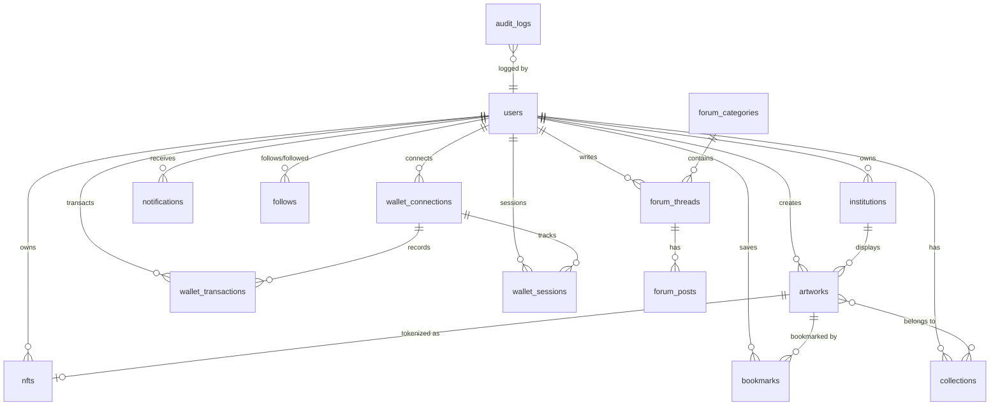

# Database Schema Documentation

## 1. Overview

Seniqu uses **Supabase** (PostgreSQL) as the primary database with advanced features including:

- **PostGIS** for geolocation queries
- **Row Level Security (RLS)** for data access control
- **Full-text search** with `pg_trgm` extension
- **Audit logging** for security compliance
- **Multi-chain wallet infrastructure** for Web3 integration

## 2. Schema Migrations

SQL migrations are located in `backend/supabase/migrations/`:

| File | Description |
|------|-------------|
| `001_initial_schema.sql` | Core tables, types, triggers, base RLS policies |
| `002_functions.sql` | PostgreSQL utility functions |
| `003_security_policies.sql` | Comprehensive RLS policies |
| `004_indexes.sql` | Performance optimization indexes |
| `005_fix_user_schema.sql` | User schema fixes |
| `006_seed_users.sql` | Seed data for development |
| `007_dashboard_enhancements.sql` | Dashboard-related schema enhancements |
| `008_add_category_and_missing_columns.sql` | Category support and missing columns |
| `009_add_google_id.sql` | Google OAuth ID column |
| `010_wallet_infrastructure.sql` | Wallet connections, nonces, sessions, rate limits |
| `011_security_hardening.sql` | Additional security policies and hardening |
| `012_fix_remaining_security.sql` | Security policy fixes |
| `013_secure_spatial_ref_sys.sql` | PostGIS security hardening |
| `014_wallet_transactions.sql` | Wallet transactions, balances cache, embedded wallet |

### Running Migrations

1. Open Supabase Dashboard → SQL Editor
2. Run each migration file **in order** (001 → 014)
3. Verify tables were created in Table Editor

> [!CAUTION]
> Always run migrations in sequence. Later migrations may reference tables or types created in earlier ones.

## 3. Custom Types (Enums)

### Core Types

```sql
-- User roles
CREATE TYPE user_role AS ENUM (
    'user', 'collector', 'artist', 'institution', 'admin', 'super_admin'
);

-- Authentication provider
CREATE TYPE auth_provider AS ENUM (
    'local', 'google', 'github', 'privy', 'wallet'
);

-- Artwork status
CREATE TYPE artwork_status AS ENUM (
    'draft', 'pending_review', 'published', 'archived', 'rejected'
);

-- NFT status
CREATE TYPE nft_status AS ENUM (
    'minting', 'minted', 'listed', 'sold', 'transferred', 'burned'
);
```

### Wallet Types

```sql
-- Blockchain chains
CREATE TYPE wallet_chain AS ENUM (
    'solana', 'ethereum', 'polygon'
);

-- Wallet providers
CREATE TYPE wallet_provider AS ENUM (
    'embedded',         -- Privy embedded wallet
    'phantom',          -- Phantom (Solana)
    'solflare',         -- Solflare (Solana)
    'metamask',         -- MetaMask (EVM)
    'walletconnect',    -- WalletConnect / Reown
    'backpack',         -- Backpack
    'coinbase',         -- Coinbase Wallet
    'other'
);

-- Wallet connection status
CREATE TYPE wallet_connection_status AS ENUM (
    'active', 'disconnected', 'revoked', 'expired'
);

-- Wallet transaction type
CREATE TYPE wallet_tx_type AS ENUM (
    'deposit', 'withdraw', 'transfer_in', 'transfer_out', 'swap'
);

-- Wallet transaction status
CREATE TYPE wallet_tx_status AS ENUM (
    'pending', 'broadcasting', 'confirming', 'confirmed', 'failed', 'cancelled'
);
```

## 4. Core Tables

### 4.1 Users

```sql
CREATE TABLE users (
    id UUID PRIMARY KEY DEFAULT uuid_generate_v4(),
    email VARCHAR(320) UNIQUE NOT NULL,
    username VARCHAR(50) UNIQUE,
    display_name VARCHAR(100),
    avatar_url TEXT,
    bio TEXT,

    -- Role & permissions
    role user_role DEFAULT 'user' NOT NULL,
    is_premium BOOLEAN DEFAULT FALSE,
    is_active BOOLEAN DEFAULT TRUE,
    is_verified BOOLEAN DEFAULT FALSE,

    -- Authentication
    password_hash VARCHAR(255),          -- NULL for OAuth / wallet users
    google_id VARCHAR(255) UNIQUE,       -- Google OAuth subject ID
    privy_id VARCHAR(100) UNIQUE,        -- Privy user ID

    -- Web3 wallets
    wallet_address VARCHAR(66) UNIQUE,            -- Primary external wallet
    embedded_wallet_address VARCHAR(66),           -- Privy embedded wallet (auto-created)

    -- Security
    failed_login_attempts INTEGER DEFAULT 0,
    locked_until TIMESTAMPTZ,
    last_login_at TIMESTAMPTZ,
    login_count INTEGER DEFAULT 0,
    email_verified_at TIMESTAMPTZ,

    -- Timestamps
    created_at TIMESTAMPTZ DEFAULT NOW(),
    updated_at TIMESTAMPTZ DEFAULT NOW()
);
```

### 4.2 Institutions (Museums/Galleries)

```sql
CREATE TABLE institutions (
    id UUID PRIMARY KEY DEFAULT uuid_generate_v4(),
    owner_id UUID REFERENCES users(id) ON DELETE CASCADE,
    name VARCHAR(200) NOT NULL,
    slug VARCHAR(200) UNIQUE NOT NULL,
    description TEXT,
    type VARCHAR(50) DEFAULT 'museum',

    -- Location (PostGIS)
    city VARCHAR(100) NOT NULL,
    province VARCHAR(100),
    country VARCHAR(100) DEFAULT 'Indonesia',
    location GEOGRAPHY(POINT, 4326),

    -- Status
    is_verified BOOLEAN DEFAULT FALSE,
    is_featured BOOLEAN DEFAULT FALSE,
    rating DECIMAL(2, 1) DEFAULT 0,
    total_artworks INTEGER DEFAULT 0,

    created_at TIMESTAMPTZ DEFAULT NOW(),
    updated_at TIMESTAMPTZ DEFAULT NOW()
);
```

### 4.3 Artworks

```sql
CREATE TABLE artworks (
    id UUID PRIMARY KEY DEFAULT uuid_generate_v4(),
    artist_id UUID REFERENCES users(id) ON DELETE CASCADE,
    institution_id UUID REFERENCES institutions(id) ON DELETE SET NULL,
    title VARCHAR(255) NOT NULL,
    slug VARCHAR(300) UNIQUE NOT NULL,
    description TEXT,
    medium VARCHAR(100),
    style VARCHAR(100),
    year_created INTEGER,
    status artwork_status DEFAULT 'draft',
    is_nft BOOLEAN DEFAULT FALSE,
    primary_image_url TEXT NOT NULL,
    views INTEGER DEFAULT 0,
    likes INTEGER DEFAULT 0,
    ai_detected_genres JSONB,
    ai_confidence_score DECIMAL(3, 2),
    created_at TIMESTAMPTZ DEFAULT NOW(),
    updated_at TIMESTAMPTZ DEFAULT NOW()
);
```

## 5. Wallet Tables

### 5.1 Wallet Connections

Tracks all wallet connections per user with verification status and device binding.

```sql
CREATE TABLE wallet_connections (
    id UUID PRIMARY KEY DEFAULT uuid_generate_v4(),
    user_id UUID NOT NULL REFERENCES users(id) ON DELETE CASCADE,
    wallet_address VARCHAR(66) NOT NULL,
    chain wallet_chain NOT NULL DEFAULT 'solana',
    provider wallet_provider NOT NULL DEFAULT 'embedded',
    label VARCHAR(100),                   -- User label (e.g., "My Phantom")
    is_primary BOOLEAN DEFAULT FALSE,
    is_embedded BOOLEAN DEFAULT FALSE,    -- Privy embedded wallet flag
    status wallet_connection_status DEFAULT 'active',
    verified_at TIMESTAMPTZ,
    device_fingerprint VARCHAR(128),      -- OWASP session binding
    last_used_at TIMESTAMPTZ DEFAULT NOW(),
    created_at TIMESTAMPTZ DEFAULT NOW(),

    UNIQUE(user_id, wallet_address, chain)
);
```

### 5.2 Wallet Nonces

Single-use nonces for signature verification. Prevents replay attacks (OWASP A7).

```sql
CREATE TABLE wallet_nonces (
    id UUID PRIMARY KEY DEFAULT uuid_generate_v4(),
    wallet_address VARCHAR(66) NOT NULL,
    chain wallet_chain NOT NULL DEFAULT 'solana',
    nonce VARCHAR(128) NOT NULL UNIQUE,
    message TEXT NOT NULL,              -- Full message that was signed
    is_used BOOLEAN DEFAULT FALSE,
    used_at TIMESTAMPTZ,
    expires_at TIMESTAMPTZ NOT NULL,    -- 5 minutes from creation
    created_at TIMESTAMPTZ DEFAULT NOW()
);
```

### 5.3 Wallet Transactions

Tracks all deposits, withdrawals, and transfers with full audit trail.

```sql
CREATE TABLE wallet_transactions (
    id UUID PRIMARY KEY DEFAULT uuid_generate_v4(),
    user_id UUID NOT NULL REFERENCES users(id) ON DELETE CASCADE,
    wallet_connection_id UUID REFERENCES wallet_connections(id),
    tx_type wallet_tx_type NOT NULL,
    status wallet_tx_status DEFAULT 'pending',
    chain wallet_chain NOT NULL DEFAULT 'solana',
    tx_hash VARCHAR(128) UNIQUE,         -- On-chain transaction hash
    block_number BIGINT,
    amount DECIMAL(30, 18) NOT NULL,     -- Native token decimals
    amount_usd DECIMAL(14, 2),           -- USD at time of tx
    fee DECIMAL(30, 18) DEFAULT 0,
    token_mint VARCHAR(66),              -- NULL = native (SOL/ETH)
    token_symbol VARCHAR(20) DEFAULT 'SOL',
    from_address VARCHAR(66) NOT NULL,
    to_address VARCHAR(66) NOT NULL,
    memo TEXT,
    confirmations INTEGER DEFAULT 0,
    confirmed_at TIMESTAMPTZ,
    created_at TIMESTAMPTZ DEFAULT NOW(),
    updated_at TIMESTAMPTZ DEFAULT NOW()
);
```

### 5.4 Wallet Balances Cache

Caches on-chain token balances to reduce RPC calls. Auto-expires after 2 minutes.

```sql
CREATE TABLE wallet_balances_cache (
    id UUID PRIMARY KEY DEFAULT uuid_generate_v4(),
    wallet_address VARCHAR(66) NOT NULL,
    chain wallet_chain NOT NULL DEFAULT 'solana',
    token_mint VARCHAR(66),              -- NULL = native token
    token_symbol VARCHAR(20) DEFAULT 'SOL',
    token_name VARCHAR(100),
    token_decimals INTEGER DEFAULT 9,
    balance DECIMAL(30, 18) NOT NULL DEFAULT 0,
    balance_usd DECIMAL(14, 2),
    last_fetched_at TIMESTAMPTZ DEFAULT NOW(),
    is_stale BOOLEAN DEFAULT FALSE,
    UNIQUE(wallet_address, chain, token_mint)
);
```

### 5.5 Wallet Sessions

Active wallet sessions with device fingerprinting for anomaly detection.

```sql
CREATE TABLE wallet_sessions (
    id UUID PRIMARY KEY DEFAULT uuid_generate_v4(),
    user_id UUID NOT NULL REFERENCES users(id) ON DELETE CASCADE,
    wallet_connection_id UUID NOT NULL REFERENCES wallet_connections(id),
    session_token_hash VARCHAR(255) NOT NULL,
    chain wallet_chain NOT NULL,
    ip_address INET,
    device_fingerprint VARCHAR(128),
    is_active BOOLEAN DEFAULT TRUE,
    expires_at TIMESTAMPTZ NOT NULL,
    last_activity_at TIMESTAMPTZ DEFAULT NOW()
);
```

## 6. Supporting Tables

### 6.1 NFTs & Marketplace

```sql
CREATE TABLE nfts (
    id UUID PRIMARY KEY DEFAULT uuid_generate_v4(),
    artwork_id UUID REFERENCES artworks(id) ON DELETE CASCADE,
    token_id VARCHAR(100) NOT NULL,
    contract_address VARCHAR(66) NOT NULL,
    creator_id UUID REFERENCES users(id),
    current_owner_id UUID REFERENCES users(id),
    status nft_status DEFAULT 'minting',
    is_listed BOOLEAN DEFAULT FALSE,
    listing_price DECIMAL(20, 8),
    royalty_percentage DECIMAL(4, 2) DEFAULT 10.00,
    UNIQUE(token_id, contract_address)
);
```

### 6.2 Audit Logs

```sql
CREATE TABLE audit_logs (
    id UUID PRIMARY KEY DEFAULT uuid_generate_v4(),
    user_id UUID REFERENCES users(id) ON DELETE SET NULL,
    action VARCHAR(100) NOT NULL,
    resource_type VARCHAR(100) NOT NULL,
    resource_id VARCHAR(255),
    ip_address INET,
    user_agent TEXT,
    old_values JSONB,
    new_values JSONB,
    metadata JSONB,
    status VARCHAR(50) DEFAULT 'success',
    created_at TIMESTAMPTZ DEFAULT NOW()
);
```

## 7. PostgreSQL Functions

### 7.1 Geolocation Search

```sql
CREATE OR REPLACE FUNCTION find_nearby_institutions(
    lat DOUBLE PRECISION,
    lng DOUBLE PRECISION,
    radius_km DOUBLE PRECISION DEFAULT 50
) RETURNS TABLE (id UUID, name VARCHAR, distance_km DOUBLE PRECISION)
AS $$ ... $$ LANGUAGE plpgsql;
```

### 7.2 Wallet Functions

| Function | Description |
|----------|-------------|
| `cleanup_expired_nonces()` | Deletes expired/used nonces from `wallet_nonces` |
| `cleanup_expired_wallet_sessions()` | Deactivates expired wallet sessions |
| `cleanup_old_rate_limits()` | Removes old rate limit windows |
| `cleanup_old_wallet_transactions()` | Archives transactions older than 1 year |
| `mark_stale_balances()` | Marks balance caches older than 2 min as stale |
| `get_user_portfolio_value(user_id)` | Calculates total portfolio USD value for a user |
| `ensure_single_primary_wallet()` | Trigger: ensures only one primary wallet per user |

## 8. Entity Relationship Diagram



## 9. Backup & Maintenance

### Scheduled Cleanup

```sql
-- Clean expired wallet nonces
SELECT cleanup_expired_nonces();

-- Deactivate expired wallet sessions
SELECT cleanup_expired_wallet_sessions();

-- Mark stale balance caches
SELECT mark_stale_balances();

-- Archive old transactions (run monthly)
SELECT cleanup_old_wallet_transactions();

-- Clean old rate limit windows
SELECT cleanup_old_rate_limits();
```

### Daily Backups

Supabase automatically creates daily backups. For manual backup:

```bash
pg_dump --schema-only $DATABASE_URL > schema.sql
pg_dump --data-only $DATABASE_URL > data.sql
```
