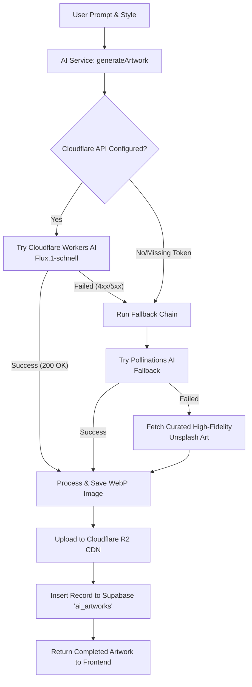

# 15. Cloudflare Workers AI & Generative Artwork Engine

This document provides a comprehensive overview of the generative AI artwork system in SeniQu. It details the migration from rate-limited/quota-restricted Gemini APIs to **Cloudflare Workers AI (Flux.1-schnell)**, the robust fallback chain, and the optimized frontend Community Feed interface.

---

## 1. Architecture Overview



To deliver a premium, uninterrupted generation experience without service degradation, the AI generation system employs a **three-tier progressive fallback architecture**:

1. **Primary Layer: Cloudflare Workers AI (Flux.1-schnell)**
   - Leverages the state-of-the-art `@cf/black-forest-labs/flux-1-schnell` model.
   - Generates high-fidelity artwork matching Nusantara styles and prompts.
   - Raw binary base64 response is decoded and uploaded to the R2 CDN.
2. **Fallback Layer 1: Pollinations AI**
   - If Cloudflare is rate-limited, returns an authentication error, or fails, the backend seamlessly triggers a request to Pollinations AI.
   - Appends style instructions and seeds to maintain prompt fidelity.
3. **Fallback Layer 2: Curated High-Fidelity Unsplash Art**
   - If all external AI generation APIs are down, the service falls back to a locally mapped set of premium, high-resolution Unsplash photographs matching the selected style.
   - Ensures the user interface never breaks and always returns an artistic asset.

---

## 2. Environment Configurations

To support Cloudflare Workers AI, the backend configuration loader is extended. The following environment variables must be populated in `backend/.env`:

```env
# ===========================================
# CLOUDFLARE WORKERS AI
# ===========================================
# Cloudflare API Token with "Workers AI" Edit permissions
CLOUDFLARE_API_TOKEN=your-cloudflare-api-token-here

# Account ID is shared with the existing R2 integration:
R2_ACCOUNT_ID=your-cloudflare-account-id
```

### Configuration Loader (`src/config/configuration.ts`)
The variables are loaded, mapped to the `ai` config namespace, and validated against the Joi schema:
```typescript
ai: {
  cfAccountId: process.env.R2_ACCOUNT_ID,
  cfApiToken: process.env.CLOUDFLARE_API_TOKEN,
}
```

---

## 3. Backend Implementation (`src/modules/ai`)

### 3.1. API Request & Data Parsing
Cloudflare Workers AI returns a JSON response containing a base64 encoded image string:
`{ "result": { "image": "/9j/4AAQSkZJRg..." } }`

The `AiService` handles this by:
1. Validating credentials.
2. Sending a POST request to:
   `https://api.cloudflare.com/client/v4/accounts/<ACCOUNT_ID>/ai/run/@cf/black-forest-labs/flux-1-schnell`
3. Parsing the response JSON and extracting the base64 string.
4. Converting the base64 string back into a raw Buffer using `Buffer.from(imageStr, 'base64')`.
5. Sending the buffer to `StorageService` to upload as a WebP image to R2 CDN.

### 3.2. Code Snippet: Generation Pipeline
```typescript
// Primary Call: Cloudflare Workers AI Flux
try {
  this.logger.log(`Generating artwork using Cloudflare Workers AI Flux...`);
  const response = await fetch(
    `https://api.cloudflare.com/client/v4/accounts/${this.cfAccountId}/ai/run/@cf/black-forest-labs/flux-1-schnell`,
    {
      method: 'POST',
      headers: {
        'Authorization': `Bearer ${this.cfApiToken}`,
        'Content-Type': 'application/json',
      },
      body: JSON.stringify({
        prompt: `${prompt}, ${style} style, high quality, digital art`,
        num_steps: 4, // flux-1-schnell is optimized for 4-8 steps
      }),
    }
  );

  if (!response.ok) {
    throw new Error(`Cloudflare API error: ${response.statusText}`);
  }

  const cfData = await response.json();
  if (cfData?.result?.image) {
    buffer = Buffer.from(cfData.result.image, 'base64');
  }
} catch (cfError: any) {
  this.logger.warn(`Cloudflare Workers AI failed: ${cfError.message}. Triggering fallback...`);
  buffer = await this.fallbackImageGeneration(prompt, style);
}
```

---

## 4. Frontend Enhancements

### 4.1. Real-Time Token Prices
To support the web3 wallet module, a robust price updater was added to `useTokenPrices.ts`:
- **Coinbase WebSocket (`wss://ws-feed.exchange.coinbase.com`)**: Serves as the primary, non-blocked realtime stream for SOL, ETH, USDC, and USDT prices. This replaces the Binance WebSocket stream which is blocked in Indonesia by government ISPs (Kominfo).
- **Dual HTTP Fallback Polling (Every 15s)**: Fetches prices from CoinGecko API, falling back to CryptoCompare if rate-limited. This ensures that the portfolio value remains updated in production even if WebSockets are blocked by security firewalls.

### 4.2. Community Feed Masonry Grid
The Community Feed (`AIDashboardPage.tsx`) was completely redesigned to prioritize mobile UX, high density, and smooth visual flow:
- **Responsive Masonry Layout**: Renders in 2 columns on mobile, 3 columns on tablet, and 4 columns on desktop. Card aspect ratios alternate (`3:4`, `1:1`, `4:5`) dynamically based on grid indexes for a modern Instagram Explore aesthetic.
- **Double-Tap to Like**: Supports natural touch gestures. Double-tapping an artwork card triggers a floating, animated heart pop overlay (`AnimatePresence`) and updates the like count via NestJS mutations.
- **Lazy Shimmer Skeletons**: CSS-animated gradient shimmer fills card backgrounds before image assets load, reducing cumulative layout shift (CLS).
- **Paginated Scrolling**: Limits initial load to 8 items, displaying a premium "Load More" navigation button to maintain light DOM performance.

---
*Document Version: 1.0.0*
*Last Updated: 2026-06-15*
