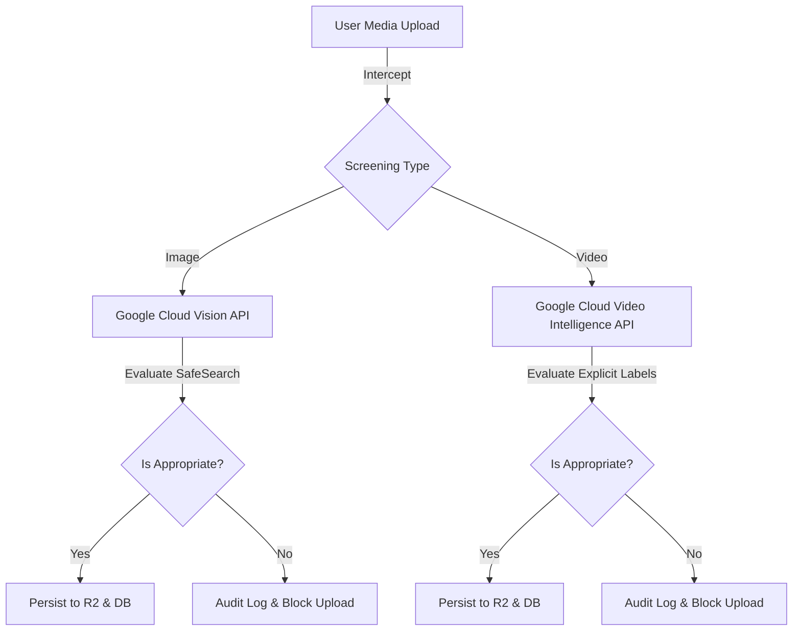

# 21 — AI Content Moderation & Notification System

This document outlines the architecture, integration details, and policies of the SeniQu platform's automated AI Content Moderation Engine and Notification System (including In-App and throttled Email Notifications).

---

## 1. AI Content Moderation Engine

To ensure a safe, clean, and professional community, SeniQu employs state-of-the-art AI-powered screening for all uploaded images and videos (e.g., in Forum posts, Reels, and Profile Avatars).



### A. Image Moderation (Google Cloud Vision API)
All image uploads are routed to `ImageModerationService` which calls the Google Cloud Vision SafeSearch Detection API.
- **Scanned Categories**:
  - `adult`: Nudity, pornographic, or sexual acts.
  - `violence`: Violence, blood, gore, or physical harm.
  - `racy`: Suggestive, revealing, or semi-nude content.
  - `medical`: Surgical or graphic medical imagery.
  - `spoof`: Manipulated, spoofed, or misleading content.
- **Threshold Policy**:
  - Any category returning `VERY_LIKELY` or `LIKELY` will trigger an immediate rejection.
  - An audit log is automatically created when content is flagged, capturing the user ID and moderation scores.

### B. Video Moderation (Google Cloud Video Intelligence API)
All video uploads (primarily Reels and Forum video attachments) are routed to `VideoModerationService` using Google Cloud Video Intelligence.
- **Scanned Categories**: Explicit content labels (nudity, violence, sexual content, gore).
- **Threshold Policy**:
  - Rejection is triggered if explicit labels return a likelihood of `LIKELY` or `VERY_LIKELY`.
  - Blocks uploads dynamically at the gateway layer, preventing unauthorized or indecent videos from reaching the storage bucket or the database.

---

## 2. Notification & Throttling System

SeniQu provides real-time in-app notifications and throttled email alerts to keep users engaged without spamming their inbox.

### A. Supported Notification Events
1. **Direct Messages / Chats**: Notifies recipient of new encrypted messages.
2. **Follows**: Notifies when a user gains a new follower.
3. **Likes**: Notifies when a user's forum thread, post, or Reel is liked.
4. **Comments**: Notifies when a user's forum thread or Reel is commented on.

### B. Double-Channel Delivery

For each event, the system dispatches to two channels:
1. **In-App Notification Bell**:
   - Persisted instantly in the `notifications` table.
   - Visible in the frontend notification panel.
2. **Email Notification (Nodemailer & Resend)**:
   - Formatted using premium HTML templates with responsive designs and cohesive branding colors.
   - Sent via the user's registered email.

### C. Spam Prevention & Email Throttling
To comply with best email practices and prevent inbox cluttering, SeniQu implements a **smart throttling window** for email notifications:
- **Chat Messages**: Maximum of **1 email per 15 minutes** per conversation.
- **Likes**: Maximum of **1 email per 10 minutes** per target content item.
- **Comments/Replies**: Maximum of **1 email per 5 minutes** per target content item.
- **Follows**: Maximum of **1 email per 10 minutes** per recipient.

```typescript
// Throttling Logic Example
const lastSentKey = `last_email:${type}:${recipientId}:${senderId}`;
const lastSentTime = this.throttles.get(lastSentKey);

if (lastSentTime && (Date.now() - lastSentTime < THROTTLE_LIMIT_MS)) {
    // Skip email sending to prevent spam
    return;
}
```

*Note: In-App notifications are never throttled, ensuring that users can always find their complete interaction history directly within the application.*
